# SOFTWARE REQUIREMENTS SPECIFICATION
# Hệ thống Quản lý Đội xe (Fleet Management System)
## Phiên bản: 1.0
## Ngày: 2026-05-19

---

# 1. Introduction

## 1.1 Purpose

Tài liệu này mô tả đầy đủ các yêu cầu phần mềm cho Hệ thống Quản lý Đội xe (Fleet Management System - FMS). Tài liệu được xây dựng theo chuẩn IEEE 830 nhằm cung cấp cái nhìn toàn diện về chức năng, kiến trúc, và các ràng buộc kỹ thuật của hệ thống.

## 1.2 Scope

Fleet Management System là ứng dụng web quản lý toàn diện hoạt động vận tải hành khách, bao gồm:

- Quản lý đội xe và bảo trì
- Quản lý tuyến đường và trạm dừng
- Lập lịch và quản lý chuyến đi
- Đặt vé và quản lý khách hàng
- Quản lý thanh toán
- Phân công nhân viên
- Check-in vé điện tử
- Dashboard thống kê và báo cáo

## 1.3 Intended Audience

| Đối tượng | Mục đích sử dụng |
|-----------|-------------------|
| Quản lý vận tải | Giám sát hoạt động, ra quyết định |
| Nhân viên điều phối | Lập lịch chuyến, phân công nhân viên |
| Nhân viên bán vé | Đặt vé, quản lý khách hàng |
| Tài xế/Phụ xe | Xem lịch trình cá nhân |
| Nhân viên soát vé | Check-in vé tại trạm |
| Kế toán | Quản lý thanh toán |
| Quản trị hệ thống | Quản lý phân quyền |

## 1.4 Definitions, Acronyms, Abbreviations

| Thuật ngữ | Định nghĩa |
|-----------|-------------|
| FMS | Fleet Management System - Hệ thống quản lý đội xe |
| Trip | Chuyến đi - một lượt vận chuyển trên tuyến cụ thể |
| Route | Tuyến đường - lộ trình từ điểm đầu đến điểm cuối |
| Station | Trạm/Bến xe |
| Booking | Đặt vé - giao dịch đặt chỗ của khách hàng |
| Ticket | Vé - chứng từ cho một ghế trên chuyến |
| Vehicle Type | Loại xe - phân loại xe theo sơ đồ ghế |
| Seat Layout | Sơ đồ ghế ngồi trên xe |
| Check-in | Soát vé - xác nhận hành khách lên xe |
| QR Code | Mã QR trên vé điện tử |
| RBAC | Role-Based Access Control - Phân quyền theo vai trò |
| FSD | Feature-Sliced Design - Kiến trúc phần mềm |
| SPA | Single Page Application |

## 1.5 References

| Tài liệu | Mô tả |
|-----------|--------|
| IEEE 830-1998 | Chuẩn đặc tả yêu cầu phần mềm |
| Supabase Documentation | Backend-as-a-Service platform |
| React Documentation | Frontend framework |
| Feature-Sliced Design | Kiến trúc frontend methodology |

## 1.6 Document Overview

Tài liệu gồm 14 phần chính: Giới thiệu, Mô tả tổng quan, Kiến trúc hệ thống, Yêu cầu chức năng, Use Cases, Thiết kế CSDL, API Specification, Yêu cầu phi chức năng, Bảo mật, UI/UX, UML Diagrams, Technology Stack, Deployment, và Rủi ro.

---

# 2. Overall Description

## 2.1 Product Perspective

Fleet Management System là ứng dụng web SPA (Single Page Application) hoạt động độc lập, sử dụng Supabase làm backend (PostgreSQL + Authentication + Real-time). Hệ thống phục vụ doanh nghiệp vận tải hành khách đường bộ với quy mô vừa và nhỏ.

## 2.2 Product Functions

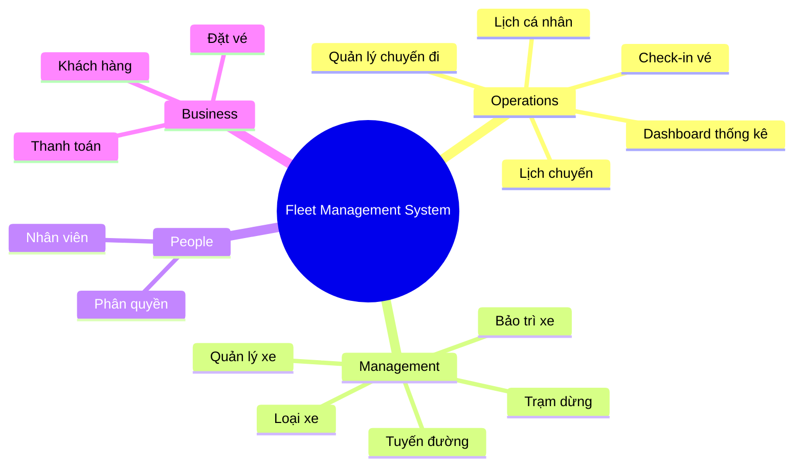
```mermaid
mindmap
  root((Fleet Management System))
    Operations
      Dashboard thống kê
      Quản lý chuyến đi
      Lịch chuyến
      Lịch cá nhân
      Check-in vé
    Management
      Quản lý xe
      Loại xe
      Bảo trì xe
      Tuyến đường
      Trạm dừng
    People
      Nhân viên
      Phân quyền
    Business
      Khách hàng
      Đặt vé
      Thanh toán
```

## 2.3 User Classes and Characteristics

| User Class | Đặc điểm | Quyền hạn |
|------------|-----------|------------|
| Admin | Quản trị toàn hệ thống | Toàn quyền, quản lý roles |
| Manager | Quản lý vận hành | CRUD tất cả entities |
| Dispatcher | Điều phối chuyến | Quản lý trips, staff assignment |
| Ticket Agent | Bán vé | Bookings, customers, payments |
| Driver | Tài xế | Xem lịch cá nhân |
| Inspector | Soát vé | Check-in tickets |

## 2.4 Operating Environment

| Thành phần | Yêu cầu |
|------------|----------|
| Client | Trình duyệt web hiện đại (Chrome, Firefox, Edge, Safari) |
| Backend | Supabase Cloud (PostgreSQL 15+) |
| Hosting | Vercel (Static hosting) |
| Network | Kết nối Internet |

## 2.5 Design and Implementation Constraints

- Frontend-only architecture (no custom backend server)
- Phụ thuộc hoàn toàn vào Supabase cho database, auth, và API
- Row Level Security (RLS) của Supabase cho authorization
- Giới hạn bởi Supabase free tier (nếu áp dụng)
- Không có server-side rendering (CSR only)
- Ngôn ngữ giao diện: Tiếng Việt

## 2.6 Assumptions and Dependencies

| Giả định | Mô tả |
|-----------|--------|
| Internet | Người dùng luôn có kết nối internet |
| Supabase | Dịch vụ Supabase hoạt động ổn định |
| Browser | Người dùng sử dụng trình duyệt hỗ trợ ES2020+ |
| Auth | Mỗi nhân viên có tài khoản email riêng |

---

# 3. System Architecture

## 3.1 High-Level Architecture

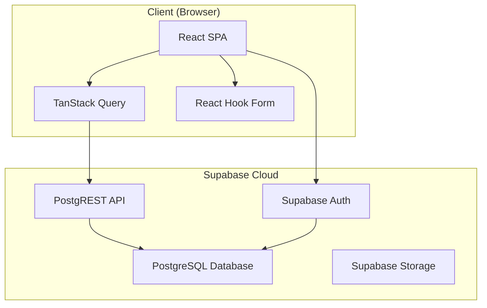
```mermaid
graph TB
    subgraph Client["Client (Browser)"]
        React["React SPA"]
        RQ["TanStack Query"]
        RHF["React Hook Form"]
    end

    subgraph Supabase["Supabase Cloud"]
        Auth["Supabase Auth"]
        PostgREST["PostgREST API"]
        PG["PostgreSQL Database"]
        Storage["Supabase Storage"]
    end

    React --> RQ
    React --> RHF
    RQ --> PostgREST
    React --> Auth
    PostgREST --> PG
    Auth --> PG
```

## 3.2 Frontend Architecture

Dự án áp dụng Feature-Sliced Design (FSD) với các layer:

```
src/
├── app/          → Application layer (providers, routing, layouts)
├── pages/        → Page components (route-level UI)
├── widgets/      → Composite UI blocks
├── features/     → User interactions and actions
├── entities/     → Business domain models + API
├── shared/       → Reusable utilities, UI components, config
```

**Responsibility từng layer:**

| Layer | Trách nhiệm |
|-------|-------------|
| app | Khởi tạo app, routing, providers, layouts |
| pages | UI cho từng route, form schemas, page-specific logic |
| entities | Data models (types), API functions, React Query hooks |
| shared | UI components, auth, API client, utilities, config |

## 3.3 Backend Architecture

Backend sử dụng Supabase (Backend-as-a-Service):

- **Authentication:** Supabase Auth với email/password
- **API:** PostgREST tự động generate REST API từ PostgreSQL schema
- **Database:** PostgreSQL với RLS policies
- **Real-time:** Supabase Realtime (chưa sử dụng trong code hiện tại)

## 3.4 Database Architecture

PostgreSQL database với 14 tables chính, sử dụng UUID primary keys và timestamp tracking (created_at, updated_at).

## 3.5 External Integrations

| Service | Mục đích | Cách tích hợp |
|---------|----------|---------------|
| Supabase Auth | Xác thực người dùng | @supabase/supabase-js SDK |
| Supabase Database | Lưu trữ dữ liệu | PostgREST via SDK |
| Vercel | Hosting & Deployment | Static site deployment |

---

# 4. Functional Requirements

## Module: Operations

### FR-01: Dashboard thống kê

#### Description
Hiển thị tổng quan hoạt động kinh doanh với các KPI và biểu đồ.

#### Actors
Manager, Admin

#### Preconditions
Người dùng đã đăng nhập thành công.

#### Main Flow
1. Hệ thống hiển thị các KPI cards: tổng xe hoạt động, chuyến hôm nay, đặt vé hôm nay, doanh thu tháng
2. Hiển thị biểu đồ doanh thu 7 ngày gần nhất
3. Hiển thị biểu đồ phân bổ trạng thái chuyến đi (tháng hiện tại)
4. Hiển thị biểu đồ phân bổ trạng thái đặt vé (tháng hiện tại)
5. Hiển thị danh sách 5 đặt vé gần nhất
6. Hiển thị danh sách 5 chuyến sắp tới

#### Business Rules
- Doanh thu tính từ payments có status = 'completed'
- Chuyến hôm nay: departure_time trong ngày hiện tại
- Đặt vé hôm nay: booking_date trong ngày hiện tại

---

### FR-02: Quản lý chuyến đi (Trips)

#### Description
CRUD chuyến đi với lọc theo trạng thái, tuyến đường, và khoảng thời gian.

#### Actors
Dispatcher, Manager, Admin

#### Preconditions
- Đã có ít nhất 1 tuyến đường và 1 xe trong hệ thống
- Người dùng đã đăng nhập

#### Main Flow
1. Hiển thị danh sách chuyến đi với phân trang (10 items/page)
2. Cho phép lọc theo: status, route, date range
3. Tạo chuyến mới: chọn route, vehicle, departure_time, estimated_arrival_time
4. Sửa thông tin chuyến
5. Xóa chuyến (nếu chưa có booking)

#### Alternative Flow
- Nếu xóa chuyến có booking liên quan → hiển thị lỗi FK violation

#### Business Rules
- estimated_arrival_time phải sau departure_time
- price_override >= 0 (nếu có)
- Status workflow: scheduled → in_progress → completed (hoặc cancelled)
- notes tối đa 500 ký tự

#### Validation Rules
- route_id: bắt buộc, UUID hợp lệ
- vehicle_id: bắt buộc, UUID hợp lệ
- departure_time: bắt buộc, format ISO datetime
- estimated_arrival_time: bắt buộc, phải sau departure_time

#### Error Handling
- 401/403: Chuyển về trang login
- 23503 (FK violation): "Dữ liệu tham chiếu không tồn tại"
- 23514 (CHECK violation): "Dữ liệu không hợp lệ"
- 22007 (datetime format): "Định dạng ngày giờ không hợp lệ"

---

### FR-03: Phân công nhân viên cho chuyến (Staff Assignment)

#### Description
Gán tài xế và phụ xe cho từng chuyến đi, kiểm tra xung đột lịch.

#### Actors
Dispatcher, Manager

#### Preconditions
- Chuyến đi đã tồn tại
- Có nhân viên active trong hệ thống

#### Main Flow
1. Chọn chuyến đi cần phân công
2. Hiển thị danh sách nhân viên đã gán
3. Thêm nhân viên: chọn employee, role (driver/assistant)
4. Hệ thống kiểm tra xung đột lịch
5. Nếu không xung đột → thêm thành công
6. Xóa nhân viên khỏi chuyến

#### Alternative Flow
- Nếu phát hiện xung đột thời gian → hiển thị cảnh báo, không cho thêm

#### Business Rules
- Mỗi nhân viên chỉ được gán 1 lần cho 1 chuyến
- Kiểm tra overlap: departure < existing_arrival AND arrival > existing_departure
- Role: 'driver' hoặc 'assistant'

---

### FR-04: Lịch chuyến đi (Trip Calendar)

#### Description
Hiển thị chuyến đi dạng lịch (calendar view) theo tháng.

#### Actors
Dispatcher, Manager

#### Main Flow
1. Hiển thị calendar view với các chuyến trong tháng
2. Cho phép chuyển tháng (trước/sau)
3. Click vào ngày để xem chi tiết chuyến

---

### FR-05: Lịch cá nhân (My Schedule)

#### Description
Nhân viên xem lịch trình chuyến đi được phân công.

#### Actors
Driver, Assistant (tất cả employees)

#### Preconditions
- Người dùng đã đăng nhập
- Có employee record liên kết với user account

#### Main Flow
1. Hệ thống tìm employee record theo user_id
2. Truy vấn trip_staff theo employee_id
3. Hiển thị danh sách chuyến được phân công

#### Alternative Flow
- Nếu user không có employee record → hiển thị danh sách trống

---

### FR-06: Check-in vé

#### Description
Soát vé hành khách bằng mã booking code, đánh dấu vé đã sử dụng.

#### Actors
Inspector

#### Preconditions
- Booking đã confirmed
- Ticket status = 'active'

#### Main Flow
1. Nhập booking code (hoặc quét QR)
2. Hệ thống tìm booking và hiển thị danh sách tickets
3. Check-in từng vé hoặc tất cả vé cùng lúc
4. Ticket status chuyển từ 'active' → 'used'

#### Business Rules
- Chỉ check-in được ticket có status = 'active'
- Check-in all: cập nhật tất cả tickets active của booking

---

## Module: Management

### FR-07: Quản lý xe (Vehicles)

#### Description
CRUD phương tiện vận tải, theo dõi trạng thái và bảo trì.

#### Actors
Manager, Admin

#### Main Flow
1. Hiển thị danh sách xe với phân trang
2. Tìm kiếm theo biển số
3. Lọc theo trạng thái (active/maintenance/retired)
4. Thêm xe mới: biển số, loại xe, VIN, năm SX, km hiện tại
5. Sửa thông tin xe
6. Xóa xe

#### Validation Rules
- license_plate: bắt buộc, tối đa 20 ký tự, tự động uppercase, unique
- vin_number: tùy chọn, tự động uppercase, unique
- year_manufactured: 1990 đến năm hiện tại + 1
- current_mileage: 0 đến 10,000,000
- next_maintenance_date >= last_maintenance_date

#### Error Handling
- 23505 (unique violation): "Biển số/VIN đã tồn tại"

---

### FR-08: Quản lý loại xe (Vehicle Types)

#### Description
Định nghĩa các loại xe với sơ đồ ghế ngồi và tiện ích.

#### Actors
Manager, Admin

#### Main Flow
1. Danh sách loại xe với phân trang
2. Tạo loại xe: tên, mô tả, số tầng, tổng ghế, sơ đồ ghế (JSON), tiện ích
3. Sửa/Xóa loại xe

#### Business Rules
- seat_layout: JSON object mô tả vị trí ghế theo tầng
- amenities: mảng string (wifi, AC, USB, etc.)
- total_floors, total_seats phải khớp với seat_layout

---

### FR-09: Quản lý bảo trì (Maintenance)

#### Description
Ghi nhận và theo dõi lịch sử bảo trì xe.

#### Actors
Manager, Admin

#### Main Flow
1. Danh sách log bảo trì với phân trang
2. Lọc theo xe và loại bảo trì
3. Tạo log: xe, loại (routine/repair/inspection/emergency), mô tả, chi phí, người thực hiện, ngày thực hiện, ngày bảo trì tiếp theo, số km
4. Sửa/Xóa log

#### Validation Rules
- vehicle_id: bắt buộc
- type: bắt buộc, enum
- cost: số >= 0
- performed_at: ngày hợp lệ

---

### FR-10: Quản lý tuyến đường (Routes)

#### Description
CRUD tuyến đường vận chuyển giữa các trạm.

#### Actors
Manager, Admin

#### Main Flow
1. Danh sách tuyến với phân trang
2. Tìm kiếm theo tên, lọc theo active/inactive
3. Tạo tuyến: tên, trạm đi, trạm đến, khoảng cách, thời gian ước tính, giá cơ bản
4. Quản lý điểm dừng trung gian (route stops)

#### Business Rules
- origin_station_id != destination_station_id
- distance_km > 0
- base_price >= 0
- estimated_duration: PostgreSQL interval format

---

### FR-11: Quản lý điểm dừng (Route Stops)

#### Description
Cấu hình các điểm dừng trung gian trên tuyến đường.

#### Actors
Manager, Admin

#### Main Flow
1. Chọn tuyến đường
2. Hiển thị danh sách stops theo thứ tự (stop_order)
3. Thêm/Xóa/Sắp xếp lại stops
4. Cấu hình: cho phép đón (pickup_allowed), cho phép trả (dropoff_allowed)
5. Lưu: xóa tất cả stops cũ, insert stops mới (replace pattern)

#### Business Rules
- Mỗi station chỉ xuất hiện 1 lần trên 1 route
- stop_order phải liên tục
- estimated_arrival: thời gian ước tính từ điểm xuất phát

---

### FR-12: Quản lý trạm (Stations)

#### Description
CRUD các bến xe/trạm dừng.

#### Actors
Manager, Admin

#### Main Flow
1. Danh sách trạm với phân trang
2. Tìm kiếm theo tên, thành phố
3. Lọc theo active/inactive
4. Tạo trạm: tên, mã, địa chỉ, thành phố, tỉnh, tọa độ GPS

#### Validation Rules
- name: bắt buộc
- code: bắt buộc, unique
- latitude: -90 đến 90
- longitude: -180 đến 180

---

## Module: People

### FR-13: Quản lý nhân viên (Employees)

#### Description
CRUD nhân viên với thông tin bằng lái và phân quyền.

#### Actors
Manager, Admin

#### Main Flow
1. Danh sách nhân viên với phân trang
2. Tìm kiếm theo tên, lọc theo active/inactive
3. Tạo nhân viên: liên kết user profile, ngày vào làm, số bằng lái, hạn bằng lái
4. Gán role cho nhân viên
5. Sửa/Xóa nhân viên

#### Business Rules
- Cảnh báo khi bằng lái sắp hết hạn (30 ngày)
- Mỗi employee liên kết 1 user profile (via user_id)
- Gán role: xóa role cũ, insert role mới (upsert pattern)

---

### FR-14: Quản lý phân quyền (Roles)

#### Description
CRUD roles với danh sách permissions.

#### Actors
Admin

#### Main Flow
1. Danh sách roles với phân trang
2. Tạo role: tên, mô tả, danh sách permissions
3. Sửa/Xóa role

#### Business Rules
- permissions: mảng string (e.g., "view_trips", "create_booking")
- Lưu ý: Hiện tại chưa có enforcement ở route level

---

## Module: Business

### FR-15: Quản lý khách hàng (Customers)

#### Description
CRUD thông tin khách hàng.

#### Actors
Ticket Agent, Manager

#### Main Flow
1. Danh sách khách hàng với phân trang
2. Tìm kiếm theo tên, SĐT, email
3. Tạo khách hàng: họ tên, SĐT, email, ngày sinh, giới tính, CMND, địa chỉ

#### Validation Rules
- full_name: bắt buộc
- phone_number: bắt buộc, regex `0\d{9,10}`
- email: tùy chọn, format email hợp lệ
- date_of_birth: không được là ngày tương lai
- Unique: phone_number, email, id_card_number

---

### FR-16: Đặt vé (Bookings)

#### Description
Tạo đặt vé cho khách hàng, bao gồm chọn chuyến, chọn ghế, và tạo tickets.

#### Actors
Ticket Agent, Manager

#### Preconditions
- Có khách hàng trong hệ thống
- Có chuyến đi available (status = scheduled)

#### Main Flow
1. Danh sách đặt vé với phân trang
2. Tìm kiếm theo booking code hoặc tên khách hàng
3. Lọc theo status, date range
4. Tạo đặt vé mới:
   a. Chọn khách hàng
   b. Chọn chuyến đi
   c. Hệ thống hiển thị ghế trống (loại bỏ ghế đã book active/used)
   d. Chọn ghế và nhập thông tin hành khách cho mỗi vé
   e. Hệ thống tạo booking + tickets (transactional)
   f. Tự động generate QR code cho mỗi ticket
5. Hủy đặt vé (cascade update)

#### Alternative Flow
- Nếu tạo ticket thất bại → compensating transaction xóa booking đã tạo
- Nếu ghế đã bị đặt (race condition) → lỗi 23505 unique violation

#### Business Rules
- booking_code: tự động generate, unique
- Booking status workflow: pending → confirmed → completed (hoặc cancelled/refunded)
- Hủy booking cascade: booking → cancelled, tickets active → cancelled, payments completed → refunded, payments pending → failed
- total_amount = sum(ticket prices)
- passenger_count = số tickets

#### Validation Rules
- customer_id: bắt buộc, UUID
- trip_id: bắt buộc, UUID
- tickets[].passenger_name: bắt buộc
- tickets[].seat_number: bắt buộc
- tickets[].price: bắt buộc, số >= 0

#### Error Handling
- 23505 với idx_tickets_no_double_booking: "Ghế đã được đặt"
- 23505 với booking_code: "Mã đặt vé trùng lặp"

---

### FR-17: Quản lý thanh toán (Payments)

#### Description
Theo dõi và cập nhật trạng thái thanh toán cho các đặt vé.

#### Actors
Ticket Agent, Accountant, Manager

#### Main Flow
1. Danh sách thanh toán với phân trang
2. Lọc theo: status, method, date range
3. Tìm kiếm theo booking code
4. Cập nhật trạng thái thanh toán

#### Business Rules
- Payment state machine:
  - pending → completed, failed
  - completed → refunded
  - failed → (terminal state)
  - refunded → (terminal state)
- Payment methods: cash, e_wallet, bank_transfer
- Mỗi booking có 1 payment record

#### Validation Rules
- Status transition phải tuân theo state machine
- amount > 0

---

# 5. Use Case Specification

## UC-01: Đăng nhập hệ thống

### Description
Người dùng xác thực để truy cập hệ thống.

### Primary Actor
Tất cả users

### Trigger
Truy cập URL hệ thống khi chưa đăng nhập

### Preconditions
- Có tài khoản email đã đăng ký trong Supabase Auth

### Main Success Scenario
1. Hệ thống hiển thị form đăng nhập
2. Người dùng nhập email và password
3. Hệ thống gọi Supabase Auth signInWithPassword
4. Xác thực thành công → redirect đến dashboard (hoặc intended URL)
5. Session được lưu và auto-refresh

### Alternative Flow
- 3a. Email/password sai → hiển thị thông báo lỗi
- 3b. Tài khoản bị khóa → hiển thị thông báo

### Postconditions
- User session active
- Auth context updated với user info

---

## UC-02: Tạo đặt vé

### Description
Nhân viên tạo đặt vé cho khách hàng.

### Primary Actor
Ticket Agent

### Trigger
Click "Tạo đặt vé mới"

### Preconditions
- Đã đăng nhập
- Có khách hàng và chuyến đi trong hệ thống

### Main Success Scenario
1. Chọn khách hàng từ danh sách
2. Chọn chuyến đi
3. Hệ thống load sơ đồ ghế và đánh dấu ghế đã đặt
4. Chọn ghế trống
5. Nhập thông tin hành khách cho mỗi ghế
6. Submit form
7. Hệ thống tạo booking record
8. Hệ thống tạo ticket records với QR codes
9. Hiển thị thông báo thành công

### Exception Flow
- 7a. Tạo booking thất bại → hiển thị lỗi
- 8a. Tạo tickets thất bại → xóa booking (compensating), hiển thị lỗi
- 8b. Ghế đã bị đặt bởi người khác → lỗi duplicate seat

### Postconditions
- Booking record created (status: pending)
- Ticket records created (status: active)
- Ghế được đánh dấu đã đặt

---

## UC-03: Check-in vé

### Description
Soát vé hành khách tại trạm.

### Primary Actor
Inspector

### Trigger
Hành khách đến trạm xuất trình vé

### Preconditions
- Booking đã confirmed
- Ticket status = active

### Main Success Scenario
1. Nhập booking code
2. Hệ thống hiển thị thông tin booking và danh sách tickets
3. Click check-in cho từng vé hoặc check-in tất cả
4. Ticket status chuyển active → used
5. Hiển thị xác nhận thành công

### Alternative Flow
- 2a. Booking code không tồn tại → thông báo không tìm thấy
- 3a. Ticket đã used → không cho check-in lại

---

## UC-04: Phân công nhân viên cho chuyến

### Description
Gán tài xế và phụ xe cho chuyến đi.

### Primary Actor
Dispatcher

### Trigger
Chuyến đi cần phân công nhân viên

### Preconditions
- Chuyến đi tồn tại
- Có nhân viên active

### Main Success Scenario
1. Mở trang staff assignment cho chuyến
2. Hiển thị nhân viên đã gán
3. Click thêm nhân viên
4. Chọn employee và role (driver/assistant)
5. Hệ thống kiểm tra xung đột lịch
6. Không có xung đột → thêm thành công

### Alternative Flow
- 5a. Phát hiện xung đột → hiển thị cảnh báo, chặn thêm

### Postconditions
- trip_staff record created
- Nhân viên thấy chuyến trong "Lịch cá nhân"

---

## UC-05: Hủy đặt vé

### Description
Hủy booking và cascade cập nhật tickets, payments.

### Primary Actor
Ticket Agent, Manager

### Trigger
Khách hàng yêu cầu hủy vé

### Main Success Scenario
1. Tìm booking cần hủy
2. Confirm hủy
3. Hệ thống cập nhật:
   - Booking status → cancelled
   - Tất cả tickets active → cancelled
   - Payments completed → refunded
   - Payments pending → failed
4. Ghế được giải phóng

### Postconditions
- Booking cancelled
- Tickets cancelled
- Payments updated
- Ghế available cho booking khác

---

# 6. Database Design

## 6.1 Entity List

| # | Entity | Table Name | Mô tả |
|---|--------|-----------|--------|
| 1 | Customer | customers | Thông tin khách hàng |
| 2 | Booking | bookings | Đặt vé |
| 3 | Ticket | tickets | Vé (từng ghế) |
| 4 | Trip | trips | Chuyến đi |
| 5 | Vehicle | vehicles | Phương tiện |
| 6 | VehicleType | vehicle_types | Loại xe |
| 7 | Route | routes | Tuyến đường |
| 8 | RouteStop | route_stops | Điểm dừng |
| 9 | Station | stations | Trạm/Bến xe |
| 10 | Employee | employees | Nhân viên |
| 11 | TripStaff | trip_staff | Phân công nhân viên |
| 12 | MaintenanceLog | maintenance_logs | Log bảo trì |
| 13 | Payment | payments | Thanh toán |
| 14 | Role | roles | Vai trò/Phân quyền |

## 6.2 Table Definitions

### Table: customers

| Field | Type | Nullable | Default | Description |
|-------|------|----------|---------|-------------|
| id | uuid | No | gen_random_uuid() | Primary key |
| full_name | text | No | - | Họ tên đầy đủ |
| phone_number | text | Yes | - | Số điện thoại (unique) |
| email | text | Yes | - | Email (unique) |
| date_of_birth | date | Yes | - | Ngày sinh |
| gender | text | Yes | - | Giới tính |
| id_card_number | text | Yes | - | Số CMND/CCCD (unique) |
| address | text | Yes | - | Địa chỉ |
| loyalty_points | integer | Yes | 0 | Điểm tích lũy |
| created_at | timestamptz | No | now() | Ngày tạo |
| updated_at | timestamptz | No | now() | Ngày cập nhật |

### Table: bookings

| Field | Type | Nullable | Default | Description |
|-------|------|----------|---------|-------------|
| id | uuid | No | gen_random_uuid() | Primary key |
| booking_code | text | No | - | Mã đặt vé (unique) |
| customer_id | uuid | No | - | FK → customers.id |
| trip_id | uuid | No | - | FK → trips.id |
| booking_date | timestamptz | No | now() | Ngày đặt |
| status | text | No | 'pending' | pending/confirmed/cancelled/completed/refunded |
| total_amount | numeric | No | - | Tổng tiền |
| passenger_count | integer | No | - | Số hành khách |
| created_by | uuid | Yes | - | FK → profiles.id |
| cancelled_at | timestamptz | Yes | - | Thời điểm hủy |
| cancelled_by | uuid | Yes | - | Người hủy |
| notes | text | Yes | - | Ghi chú |
| created_at | timestamptz | No | now() | Ngày tạo |
| updated_at | timestamptz | No | now() | Ngày cập nhật |

### Table: tickets

| Field | Type | Nullable | Default | Description |
|-------|------|----------|---------|-------------|
| id | uuid | No | gen_random_uuid() | Primary key |
| booking_id | uuid | No | - | FK → bookings.id |
| trip_id | uuid | No | - | FK → trips.id |
| seat_number | text | No | - | Số ghế |
| passenger_name | text | No | - | Tên hành khách |
| passenger_id_card | text | Yes | - | CMND hành khách |
| passenger_phone | text | Yes | - | SĐT hành khách |
| price | numeric | No | - | Giá vé |
| status | text | No | 'active' | active/used/cancelled/refunded |
| qr_code | text | Yes | - | Mã QR |
| issued_by | uuid | Yes | - | Người phát vé |
| created_at | timestamptz | No | now() | Ngày tạo |
| updated_at | timestamptz | No | now() | Ngày cập nhật |

### Table: trips

| Field | Type | Nullable | Default | Description |
|-------|------|----------|---------|-------------|
| id | uuid | No | gen_random_uuid() | Primary key |
| route_id | uuid | No | - | FK → routes.id |
| vehicle_id | uuid | No | - | FK → vehicles.id |
| departure_time | timestamptz | No | - | Giờ khởi hành |
| estimated_arrival_time | timestamptz | No | - | Giờ đến dự kiến |
| actual_arrival_time | timestamptz | Yes | - | Giờ đến thực tế |
| status | text | No | 'scheduled' | scheduled/in_progress/completed/cancelled |
| price_override | numeric | Yes | - | Giá ghi đè |
| notes | text | Yes | - | Ghi chú |
| created_at | timestamptz | No | now() | Ngày tạo |
| updated_at | timestamptz | No | now() | Ngày cập nhật |

### Table: vehicles

| Field | Type | Nullable | Default | Description |
|-------|------|----------|---------|-------------|
| id | uuid | No | gen_random_uuid() | Primary key |
| vehicle_type_id | uuid | No | - | FK → vehicle_types.id |
| license_plate | text | No | - | Biển số (unique) |
| vin_number | text | Yes | - | Số VIN (unique) |
| year_manufactured | integer | Yes | - | Năm sản xuất |
| status | text | No | 'active' | active/maintenance/retired |
| current_mileage | integer | Yes | - | Số km hiện tại |
| last_maintenance_date | date | Yes | - | Ngày bảo trì gần nhất |
| next_maintenance_date | date | Yes | - | Ngày bảo trì tiếp theo |
| notes | text | Yes | - | Ghi chú |
| created_at | timestamptz | No | now() | Ngày tạo |
| updated_at | timestamptz | No | now() | Ngày cập nhật |

### Table: vehicle_types

| Field | Type | Nullable | Default | Description |
|-------|------|----------|---------|-------------|
| id | uuid | No | gen_random_uuid() | Primary key |
| name | text | No | - | Tên loại xe |
| description | text | Yes | - | Mô tả |
| seat_layout | jsonb | Yes | - | Sơ đồ ghế (JSON) |
| total_floors | integer | Yes | - | Số tầng |
| total_seats | integer | Yes | - | Tổng số ghế |
| amenities | text[] | Yes | - | Tiện ích |
| created_at | timestamptz | No | now() | Ngày tạo |
| updated_at | timestamptz | No | now() | Ngày cập nhật |

### Table: routes

| Field | Type | Nullable | Default | Description |
|-------|------|----------|---------|-------------|
| id | uuid | No | gen_random_uuid() | Primary key |
| name | text | No | - | Tên tuyến |
| origin_station_id | uuid | No | - | FK → stations.id (điểm đi) |
| destination_station_id | uuid | No | - | FK → stations.id (điểm đến) |
| distance_km | numeric | Yes | - | Khoảng cách (km) |
| estimated_duration | interval | Yes | - | Thời gian ước tính |
| base_price | numeric | Yes | - | Giá cơ bản |
| is_active | boolean | No | true | Trạng thái hoạt động |
| created_at | timestamptz | No | now() | Ngày tạo |
| updated_at | timestamptz | No | now() | Ngày cập nhật |

### Table: route_stops

| Field | Type | Nullable | Default | Description |
|-------|------|----------|---------|-------------|
| route_id | uuid | No | - | FK → routes.id (PK) |
| station_id | uuid | No | - | FK → stations.id (PK) |
| stop_order | integer | No | - | Thứ tự dừng |
| estimated_arrival | interval | Yes | - | Thời gian đến ước tính |
| pickup_allowed | boolean | No | true | Cho phép đón khách |
| dropoff_allowed | boolean | No | true | Cho phép trả khách |

### Table: stations

| Field | Type | Nullable | Default | Description |
|-------|------|----------|---------|-------------|
| id | uuid | No | gen_random_uuid() | Primary key |
| name | text | No | - | Tên trạm |
| code | text | No | - | Mã trạm (unique) |
| address | text | Yes | - | Địa chỉ |
| city | text | Yes | - | Thành phố |
| province | text | Yes | - | Tỉnh/Thành |
| latitude | numeric | Yes | - | Vĩ độ |
| longitude | numeric | Yes | - | Kinh độ |
| is_active | boolean | No | true | Trạng thái |
| created_at | timestamptz | No | now() | Ngày tạo |
| updated_at | timestamptz | No | now() | Ngày cập nhật |

### Table: employees

| Field | Type | Nullable | Default | Description |
|-------|------|----------|---------|-------------|
| id | uuid | No | gen_random_uuid() | Primary key |
| user_id | uuid | No | - | FK → auth.users.id |
| hire_date | date | Yes | - | Ngày vào làm |
| license_number | text | Yes | - | Số bằng lái |
| license_expiry | date | Yes | - | Hạn bằng lái |
| is_active | boolean | No | true | Trạng thái |
| created_at | timestamptz | No | now() | Ngày tạo |
| updated_at | timestamptz | No | now() | Ngày cập nhật |

### Table: trip_staff

| Field | Type | Nullable | Default | Description |
|-------|------|----------|---------|-------------|
| trip_id | uuid | No | - | FK → trips.id (PK) |
| employee_id | uuid | No | - | FK → employees.id (PK) |
| role | text | No | - | driver/assistant |
| notes | text | Yes | - | Ghi chú |
| created_at | timestamptz | No | now() | Ngày tạo |
| updated_at | timestamptz | No | now() | Ngày cập nhật |

### Table: maintenance_logs

| Field | Type | Nullable | Default | Description |
|-------|------|----------|---------|-------------|
| id | uuid | No | gen_random_uuid() | Primary key |
| vehicle_id | uuid | No | - | FK → vehicles.id |
| type | text | No | - | routine/repair/inspection/emergency |
| description | text | Yes | - | Mô tả công việc |
| cost | numeric | Yes | - | Chi phí |
| performed_by | uuid | Yes | - | FK → profiles.id |
| performed_at | date | Yes | - | Ngày thực hiện |
| next_due_date | date | Yes | - | Ngày bảo trì tiếp |
| odometer_reading | integer | Yes | - | Số km tại thời điểm |
| notes | text | Yes | - | Ghi chú |
| created_at | timestamptz | No | now() | Ngày tạo |
| updated_at | timestamptz | No | now() | Ngày cập nhật |

### Table: payments

| Field | Type | Nullable | Default | Description |
|-------|------|----------|---------|-------------|
| id | uuid | No | gen_random_uuid() | Primary key |
| booking_id | uuid | No | - | FK → bookings.id |
| amount | numeric | No | - | Số tiền |
| method | text | No | - | cash/e_wallet/bank_transfer |
| status | text | No | 'pending' | pending/completed/failed/refunded |
| transaction_reference | text | Yes | - | Mã giao dịch |
| paid_at | timestamptz | Yes | - | Thời điểm thanh toán |
| refunded_at | timestamptz | Yes | - | Thời điểm hoàn tiền |
| processed_by | uuid | Yes | - | FK → profiles.id |
| notes | text | Yes | - | Ghi chú |
| created_at | timestamptz | No | now() | Ngày tạo |
| updated_at | timestamptz | No | now() | Ngày cập nhật |

### Table: roles

| Field | Type | Nullable | Default | Description |
|-------|------|----------|---------|-------------|
| id | uuid | No | gen_random_uuid() | Primary key |
| name | text | No | - | Tên role |
| description | text | Yes | - | Mô tả |
| permissions | text[] | No | '{}' | Danh sách quyền |
| created_at | timestamptz | No | now() | Ngày tạo |
| updated_at | timestamptz | No | now() | Ngày cập nhật |

## 6.3 Relationships

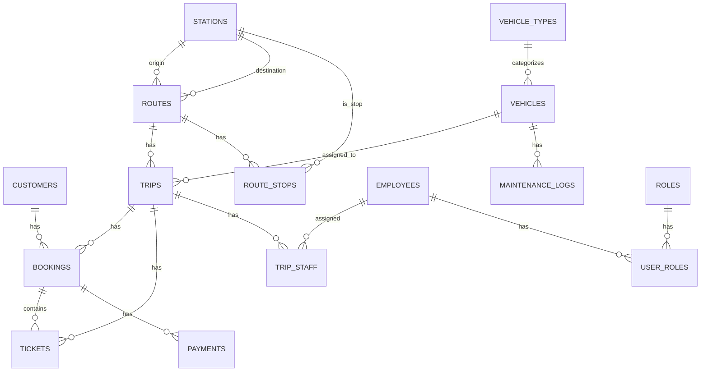
```mermaid
erDiagram
    CUSTOMERS ||--o{ BOOKINGS : "has"
    TRIPS ||--o{ BOOKINGS : "has"
    BOOKINGS ||--o{ TICKETS : "contains"
    TRIPS ||--o{ TICKETS : "has"
    ROUTES ||--o{ TRIPS : "has"
    VEHICLES ||--o{ TRIPS : "assigned_to"
    VEHICLE_TYPES ||--o{ VEHICLES : "categorizes"
    STATIONS ||--o{ ROUTES : "origin"
    STATIONS ||--o{ ROUTES : "destination"
    ROUTES ||--o{ ROUTE_STOPS : "has"
    STATIONS ||--o{ ROUTE_STOPS : "is_stop"
    TRIPS ||--o{ TRIP_STAFF : "has"
    EMPLOYEES ||--o{ TRIP_STAFF : "assigned"
    VEHICLES ||--o{ MAINTENANCE_LOGS : "has"
    BOOKINGS ||--o{ PAYMENTS : "has"
    ROLES ||--o{ USER_ROLES : "has"
    EMPLOYEES ||--o{ USER_ROLES : "has"
```

## 6.4 Constraints

| Table | Constraint | Type | Description |
|-------|-----------|------|-------------|
| customers | phone_number | UNIQUE | SĐT không trùng |
| customers | email | UNIQUE | Email không trùng |
| customers | id_card_number | UNIQUE | CMND không trùng |
| bookings | booking_code | UNIQUE | Mã đặt vé không trùng |
| tickets | idx_tickets_no_double_booking | UNIQUE(trip_id, seat_number) | Không đặt trùng ghế |
| vehicles | license_plate | UNIQUE | Biển số không trùng |
| vehicles | vin_number | UNIQUE | VIN không trùng |
| stations | code | UNIQUE | Mã trạm không trùng |
| trip_staff | (trip_id, employee_id) | PRIMARY KEY | Composite PK |
| route_stops | (route_id, station_id) | PRIMARY KEY | Composite PK |

## 6.5 Indexes

| Table | Index | Columns | Purpose |
|-------|-------|---------|---------|
| tickets | idx_tickets_no_double_booking | trip_id, seat_number | Prevent double booking |
| bookings | - | booking_code | Fast lookup by code |
| vehicles | - | license_plate | Search by plate |
| trips | - | departure_time | Date range queries |

---

# 7. API Specification

Hệ thống sử dụng Supabase PostgREST API. Tất cả endpoints đều qua Supabase client SDK.

## 7.1 Authentication API

### Endpoint: POST /auth/v1/token?grant_type=password

#### Description
Đăng nhập bằng email và password.

#### Request Body
```json
{
  "email": "user@example.com",
  "password": "password123"
}
```

#### Response (200)
```json
{
  "access_token": "eyJ...",
  "refresh_token": "...",
  "user": { "id": "uuid", "email": "..." }
}
```

#### Error Response (401)
```json
{ "error": "Invalid login credentials" }
```

---

## 7.2 Customers API

### Endpoint: GET /rest/v1/customers

#### Description
Lấy danh sách khách hàng với phân trang và tìm kiếm.

#### Request Parameters
| Param | Type | Required | Description |
|-------|------|----------|-------------|
| page | number | No | Trang (default: 1) |
| pageSize | number | No | Số item/trang (default: 10) |
| search | string | No | Tìm theo tên, SĐT, email |

#### Response (200)
```json
{
  "data": [
    {
      "id": "uuid",
      "full_name": "Nguyễn Văn A",
      "phone_number": "0901234567",
      "email": "a@example.com",
      "date_of_birth": "1990-01-01",
      "gender": "male",
      "id_card_number": "012345678",
      "address": "Hà Nội",
      "loyalty_points": 100,
      "created_at": "2026-01-01T00:00:00Z",
      "updated_at": "2026-01-01T00:00:00Z"
    }
  ],
  "count": 50
}
```

#### Authentication
Bearer token (Supabase session)

---

### Endpoint: POST /rest/v1/customers

#### Description
Tạo khách hàng mới.

#### Request Body
```json
{
  "full_name": "Nguyễn Văn A",
  "phone_number": "0901234567",
  "email": "a@example.com",
  "date_of_birth": "1990-01-01",
  "gender": "male",
  "id_card_number": "012345678",
  "address": "Hà Nội"
}
```

#### Response (201)
```json
{ "id": "uuid", "full_name": "Nguyễn Văn A", ... }
```

#### Error Response (409)
```json
{ "code": "23505", "message": "duplicate key value violates unique constraint" }
```

---

## 7.3 Bookings API

### Endpoint: GET /rest/v1/bookings

#### Description
Lấy danh sách đặt vé với join customer và trip info.

#### Request Parameters
| Param | Type | Required | Description |
|-------|------|----------|-------------|
| page | number | No | Trang |
| pageSize | number | No | Số item/trang |
| status | string | No | Filter by status |
| dateFrom | string | No | ISO date from |
| dateTo | string | No | ISO date to |
| search | string | No | Tìm theo booking_code hoặc customer name |

#### Response (200)
```json
{
  "data": [
    {
      "id": "uuid",
      "booking_code": "BK-20260101-001",
      "customer_id": "uuid",
      "trip_id": "uuid",
      "booking_date": "2026-01-01T10:00:00Z",
      "status": "confirmed",
      "total_amount": 500000,
      "passenger_count": 2,
      "notes": null,
      "customer": { "id": "uuid", "full_name": "Nguyễn Văn A" },
      "trip": { "id": "uuid", "departure_time": "...", "route": { "name": "HN-HP" } }
    }
  ],
  "count": 100
}
```

---

### Endpoint: POST /rest/v1/bookings + /rest/v1/tickets (Transactional)

#### Description
Tạo đặt vé mới kèm tickets. Sử dụng compensating transaction pattern.

#### Request Body
```json
{
  "customer_id": "uuid",
  "trip_id": "uuid",
  "booking_code": "BK-20260101-001",
  "booking_date": "2026-01-01T10:00:00Z",
  "status": "pending",
  "total_amount": 500000,
  "passenger_count": 2,
  "tickets": [
    {
      "seat_number": "A1",
      "passenger_name": "Nguyễn Văn A",
      "passenger_phone": "0901234567",
      "passenger_id_card": "012345678",
      "price": 250000
    }
  ]
}
```

---

## 7.4 Trips API

### Endpoint: GET /rest/v1/trips

#### Description
Lấy danh sách chuyến đi với join route và vehicle info.

#### Request Parameters
| Param | Type | Required | Description |
|-------|------|----------|-------------|
| page | number | No | Trang |
| pageSize | number | No | Số item/trang |
| status | string | No | Filter by status |
| routeId | string | No | Filter by route |
| dateFrom | string | No | ISO date from |
| dateTo | string | No | ISO date to |

---

### Endpoint: GET /rest/v1/trips (Calendar)

#### Description
Lấy tất cả chuyến trong khoảng thời gian (không phân trang, cho calendar view).

#### Request Parameters
| Param | Type | Required | Description |
|-------|------|----------|-------------|
| startDate | string | Yes | ISO date start |
| endDate | string | Yes | ISO date end |

---

## 7.5 Vehicles API

### Endpoint: GET /rest/v1/vehicles

#### Request Parameters
| Param | Type | Required | Description |
|-------|------|----------|-------------|
| page | number | No | Trang |
| pageSize | number | No | Số item/trang |
| search | string | No | Tìm theo biển số |
| status | string | No | Filter by status |

---

## 7.6 Payments API

### Endpoint: PATCH /rest/v1/payments/:id

#### Description
Cập nhật trạng thái thanh toán (có state machine validation).

#### Request Body
```json
{
  "status": "completed",
  "paid_at": "2026-01-01T10:00:00Z",
  "processed_by": "uuid"
}
```

#### Business Logic
```
Allowed transitions:
  pending → completed | failed
  completed → refunded
  failed → (none)
  refunded → (none)
```

#### Error Response (400)
```json
{ "error": "Invalid status transition from 'failed' to 'completed'" }
```

---

## 7.7 Tickets API

### Endpoint: PATCH /rest/v1/tickets/:id (Check-in)

#### Description
Check-in một vé (active → used).

#### Request Body
```json
{ "status": "used" }
```

---

### Endpoint: GET /rest/v1/tickets (Booked Seats)

#### Description
Lấy danh sách ghế đã đặt cho một chuyến.

#### Request Parameters
| Param | Type | Required | Description |
|-------|------|----------|-------------|
| trip_id | uuid | Yes | ID chuyến |
| status | string | Yes | in.(active,used) |

---

## 7.8 Dashboard API

### Endpoint: Multiple aggregation queries

#### Description
Dashboard gọi nhiều queries song song:

| Query | Mô tả |
|-------|--------|
| fetchDashboardStats | KPI: tổng xe active, chuyến hôm nay, booking hôm nay, doanh thu tháng |
| fetchRecentBookings | 5 booking gần nhất |
| fetchUpcomingTrips | 5 chuyến sắp tới |
| fetchRevenueTrend | Doanh thu 7 ngày (group by date) |
| fetchTripStatusBreakdown | Phân bổ status chuyến (tháng hiện tại) |
| fetchBookingStatusBreakdown | Phân bổ status booking (tháng hiện tại) |

---

# 8. Non-Functional Requirements

## 8.1 Performance

| Yêu cầu | Mô tả |
|----------|--------|
| NFR-01 | Thời gian load trang < 3 giây (first contentful paint) |
| NFR-02 | API response time < 500ms cho queries đơn giản |
| NFR-03 | Lazy loading cho tất cả route components |
| NFR-04 | Debounce search input 300ms để giảm API calls |
| NFR-05 | React Query caching để tránh re-fetch không cần thiết |

## 8.2 Scalability

| Yêu cầu | Mô tả |
|----------|--------|
| NFR-06 | Phân trang tất cả danh sách (default 10 items) |
| NFR-07 | Offset-based pagination với count query |
| NFR-08 | Supabase auto-scaling cho database connections |

## 8.3 Security

| Yêu cầu | Mô tả |
|----------|--------|
| NFR-09 | Authentication bắt buộc cho tất cả routes (trừ /login) |
| NFR-10 | JWT token-based session management |
| NFR-11 | Auto-refresh token khi hết hạn |
| NFR-12 | Environment variables cho sensitive config |

## 8.4 Availability

| Yêu cầu | Mô tả |
|----------|--------|
| NFR-13 | Phụ thuộc Supabase SLA (99.9% uptime) |
| NFR-14 | Vercel hosting với global CDN |
| NFR-15 | Error boundaries prevent full app crash |

## 8.5 Maintainability

| Yêu cầu | Mô tả |
|----------|--------|
| NFR-16 | TypeScript strict mode cho type safety |
| NFR-17 | Feature-Sliced Design cho code organization |
| NFR-18 | Centralized API layer per entity |
| NFR-19 | Shared UI component library |

## 8.6 Reliability

| Yêu cầu | Mô tả |
|----------|--------|
| NFR-20 | Compensating transactions cho booking creation |
| NFR-21 | State machine validation cho payment status |
| NFR-22 | Zod schema validation cho tất cả form inputs |
| NFR-23 | Error handling với user-friendly messages |

## 8.7 Usability

| Yêu cầu | Mô tả |
|----------|--------|
| NFR-24 | Giao diện tiếng Việt |
| NFR-25 | Responsive design (Tailwind CSS) |
| NFR-26 | Loading skeletons cho better perceived performance |
| NFR-27 | Toast notifications cho feedback |
| NFR-28 | Confirmation dialogs cho destructive actions |

---

# 9. Security Requirements

## 9.1 Authentication

| # | Yêu cầu | Implementation |
|---|----------|----------------|
| SEC-01 | Email/Password authentication | Supabase Auth signInWithPassword |
| SEC-02 | Session management | JWT tokens với auto-refresh |
| SEC-03 | Protected routes | ProtectedRoute component redirect |
| SEC-04 | Session persistence | Supabase handles token storage |
| SEC-05 | Logout | supabase.auth.signOut() clears session |

## 9.2 Authorization (RBAC)

| # | Yêu cầu | Status |
|---|----------|--------|
| SEC-06 | Role definitions | Implemented (roles table) |
| SEC-07 | Permission arrays | Implemented (permissions field) |
| SEC-08 | Route-level enforcement | Chưa implement |
| SEC-09 | API-level enforcement | Phụ thuộc Supabase RLS |
| SEC-10 | User-role assignment | Implemented (user_roles table) |

## 9.3 Data Protection

| # | Yêu cầu | Implementation |
|---|----------|----------------|
| SEC-11 | Password hashing | Supabase Auth (bcrypt) |
| SEC-12 | HTTPS enforcement | Supabase + Vercel default |
| SEC-13 | Environment variable protection | VITE_ prefix, .env.local gitignored |
| SEC-14 | Input validation | Zod schemas on all forms |
| SEC-15 | SQL injection prevention | Supabase SDK parameterized queries |

## 9.4 Gaps và Limitations

| # | Gap | Risk Level |
|---|-----|-----------|
| GAP-01 | Không có route-level permission enforcement | Medium |
| GAP-02 | Không có rate limiting (client-side) | Low |
| GAP-03 | Không có audit logging | Medium |
| GAP-04 | Không có CSRF protection (SPA, token-based) | Low |
| GAP-05 | Anon key exposed trong client bundle | Low (RLS mitigates) |

---

# 10. UI/UX Flow

## 10.1 Screen List

| # | Screen | Route | Mô tả |
|---|--------|-------|--------|
| 1 | Login | /login | Đăng nhập |
| 2 | Dashboard | /dashboard | Tổng quan |
| 3 | Trips List | /trips | Danh sách chuyến |
| 4 | Trip Form | /trips/new, /trips/:id/edit | Tạo/Sửa chuyến |
| 5 | Staff Assignment | /trips/:id/staff | Phân công nhân viên |
| 6 | Trip Calendar | /trips/calendar | Lịch chuyến |
| 7 | My Schedule | /my-schedule | Lịch cá nhân |
| 8 | Check-in | /check-in | Soát vé |
| 9 | Vehicles List | /vehicles | Danh sách xe |
| 10 | Vehicle Types | /vehicle-types | Loại xe |
| 11 | Maintenance List | /maintenance | Bảo trì |
| 12 | Maintenance Form | /maintenance/new, /:id/edit | Tạo/Sửa log bảo trì |
| 13 | Routes List | /routes | Tuyến đường |
| 14 | Route Form | /routes/new, /routes/:id/edit | Tạo/Sửa tuyến |
| 15 | Route Stops | /routes/:id/stops | Điểm dừng |
| 16 | Stations | /stations | Trạm |
| 17 | Employees List | /employees | Nhân viên |
| 18 | Employee Form | /employees/new, /:id/edit | Tạo/Sửa NV |
| 19 | Roles | /roles | Phân quyền |
| 20 | Customers | /customers | Khách hàng |
| 21 | Bookings List | /bookings | Đặt vé |
| 22 | Booking Form | /bookings/new | Tạo đặt vé |
| 23 | Payments | /payments | Thanh toán |

## 10.2 Navigation Flow

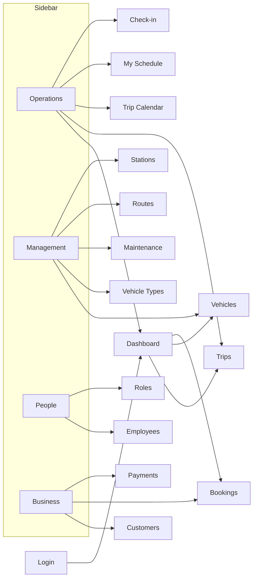
```mermaid
graph LR
    Login --> Dashboard
    Dashboard --> Trips
    Dashboard --> Vehicles
    Dashboard --> Bookings

    subgraph Sidebar
        Operations["Operations"]
        Management["Management"]
        People["People"]
        Business["Business"]
    end

    Operations --> Dashboard
    Operations --> Trips
    Operations --> TripCalendar["Trip Calendar"]
    Operations --> MySchedule["My Schedule"]
    Operations --> CheckIn["Check-in"]

    Management --> Vehicles
    Management --> VehicleTypes["Vehicle Types"]
    Management --> Maintenance
    Management --> Routes
    Management --> Stations

    People --> Employees
    People --> Roles

    Business --> Customers
    Business --> Bookings
    Business --> Payments
```

## 10.3 Component Interaction Pattern

Mỗi page tuân theo pattern chung:

```
Page Component
├── Header (Title + Action Button)
├── Filter Bar (Search + Status Select + Date Range)
├── DataTable (Sortable columns + Pagination)
│   └── Row Actions (Edit, Delete via Dropdown)
└── Form Dialog/Page (React Hook Form + Zod)
```

## 10.4 State Management

| Layer | Technology | Scope |
|-------|-----------|-------|
| Server State | TanStack React Query | API data caching, mutations |
| Auth State | React Context | User session, auth status |
| Form State | React Hook Form | Form inputs, validation |
| UI State | React useState | Local component state |
| URL State | React Router | Route params, search params |

---

# 11. UML Diagrams

## 11.1 Use Case Diagram

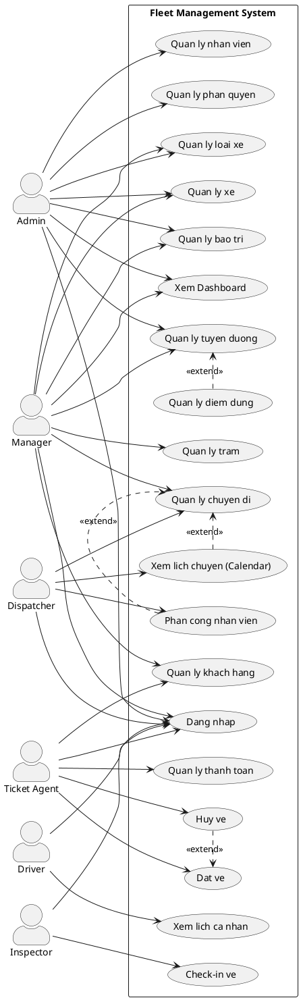
```plantuml
@startuml Fleet Management System - Use Case Diagram
left to right direction
skinparam packageStyle rectangle
skinparam actorStyle awesome

actor "Admin" as Admin
actor "Manager" as Manager
actor "Dispatcher" as Dispatcher
actor "Ticket Agent" as TicketAgent
actor "Driver" as Driver
actor "Inspector" as Inspector

rectangle "Fleet Management System" {
    usecase "Dang nhap" as UC1
    usecase "Xem Dashboard" as UC2
    usecase "Quan ly chuyen di" as UC3
    usecase "Phan cong nhan vien" as UC4
    usecase "Xem lich ca nhan" as UC5
    usecase "Check-in ve" as UC6
    usecase "Quan ly xe" as UC7
    usecase "Quan ly bao tri" as UC8
    usecase "Quan ly tuyen duong" as UC9
    usecase "Quan ly tram" as UC10
    usecase "Quan ly nhan vien" as UC11
    usecase "Quan ly phan quyen" as UC12
    usecase "Quan ly khach hang" as UC13
    usecase "Dat ve" as UC14
    usecase "Huy ve" as UC15
    usecase "Quan ly thanh toan" as UC16
    usecase "Quan ly loai xe" as UC17
    usecase "Quan ly diem dung" as UC18
    usecase "Xem lich chuyen (Calendar)" as UC19

    UC4 .> UC3 : <<extend>>
    UC15 .> UC14 : <<extend>>
    UC18 .> UC9 : <<extend>>
    UC19 .> UC3 : <<extend>>
}

Admin --> UC1
Admin --> UC2
Admin --> UC7
Admin --> UC8
Admin --> UC9
Admin --> UC11
Admin --> UC12
Admin --> UC17

Manager --> UC1
Manager --> UC2
Manager --> UC3
Manager --> UC7
Manager --> UC8
Manager --> UC9
Manager --> UC10
Manager --> UC13
Manager --> UC17

Dispatcher --> UC1
Dispatcher --> UC3
Dispatcher --> UC4
Dispatcher --> UC19

TicketAgent --> UC1
TicketAgent --> UC13
TicketAgent --> UC14
TicketAgent --> UC15
TicketAgent --> UC16

Driver --> UC1
Driver --> UC5

Inspector --> UC1
Inspector --> UC6
@enduml
```

### Use Case Diagram chi tiết theo module

#### Module: Operations

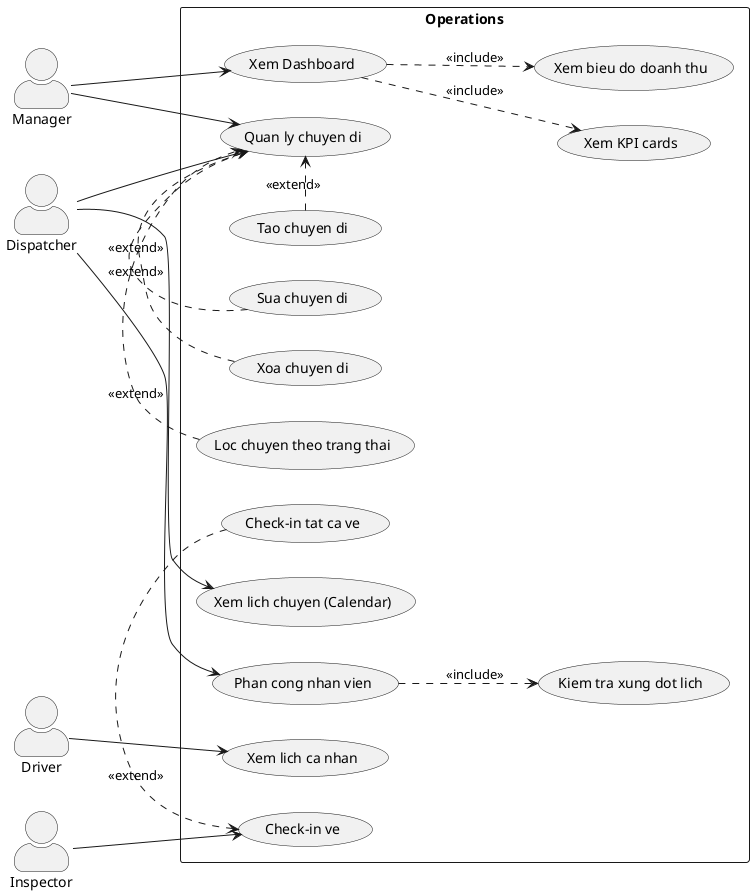
```plantuml
@startuml Operations Module
left to right direction
skinparam actorStyle awesome

actor "Manager" as Manager
actor "Dispatcher" as Dispatcher
actor "Driver" as Driver
actor "Inspector" as Inspector

rectangle "Operations" {
    usecase "Xem Dashboard" as UC_DASH
    usecase "Xem KPI cards" as UC_KPI
    usecase "Xem bieu do doanh thu" as UC_CHART
    usecase "Quan ly chuyen di" as UC_TRIP
    usecase "Tao chuyen di" as UC_TRIP_C
    usecase "Sua chuyen di" as UC_TRIP_U
    usecase "Xoa chuyen di" as UC_TRIP_D
    usecase "Loc chuyen theo trang thai" as UC_TRIP_F
    usecase "Phan cong nhan vien" as UC_STAFF
    usecase "Kiem tra xung dot lich" as UC_CONFLICT
    usecase "Xem lich chuyen (Calendar)" as UC_CAL
    usecase "Xem lich ca nhan" as UC_SCHED
    usecase "Check-in ve" as UC_CHECKIN
    usecase "Check-in tat ca ve" as UC_CHECKIN_ALL

    UC_DASH ..> UC_KPI : <<include>>
    UC_DASH ..> UC_CHART : <<include>>
    UC_TRIP_C .> UC_TRIP : <<extend>>
    UC_TRIP_U .> UC_TRIP : <<extend>>
    UC_TRIP_D .> UC_TRIP : <<extend>>
    UC_TRIP_F .> UC_TRIP : <<extend>>
    UC_STAFF ..> UC_CONFLICT : <<include>>
    UC_CHECKIN_ALL .> UC_CHECKIN : <<extend>>
}

Manager --> UC_DASH
Manager --> UC_TRIP

Dispatcher --> UC_TRIP
Dispatcher --> UC_STAFF
Dispatcher --> UC_CAL

Driver --> UC_SCHED

Inspector --> UC_CHECKIN
@enduml
```

#### Module: Management

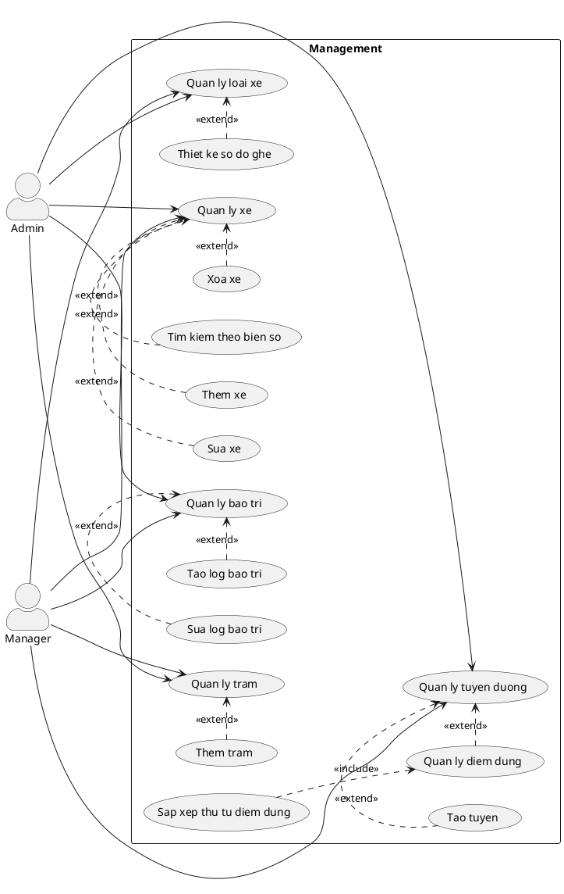
```plantuml
@startuml Management Module
left to right direction
skinparam actorStyle awesome

actor "Admin" as Admin
actor "Manager" as Manager

rectangle "Management" {
    usecase "Quan ly xe" as UC_VEH
    usecase "Them xe" as UC_VEH_C
    usecase "Sua xe" as UC_VEH_U
    usecase "Xoa xe" as UC_VEH_D
    usecase "Tim kiem theo bien so" as UC_VEH_S

    usecase "Quan ly loai xe" as UC_VT
    usecase "Thiet ke so do ghe" as UC_SEAT

    usecase "Quan ly bao tri" as UC_MAINT
    usecase "Tao log bao tri" as UC_MAINT_C
    usecase "Sua log bao tri" as UC_MAINT_U

    usecase "Quan ly tuyen duong" as UC_ROUTE
    usecase "Tao tuyen" as UC_ROUTE_C
    usecase "Quan ly diem dung" as UC_STOPS
    usecase "Sap xep thu tu diem dung" as UC_STOPS_ORDER

    usecase "Quan ly tram" as UC_STATION
    usecase "Them tram" as UC_STATION_C

    UC_VEH_C .> UC_VEH : <<extend>>
    UC_VEH_U .> UC_VEH : <<extend>>
    UC_VEH_D .> UC_VEH : <<extend>>
    UC_VEH_S .> UC_VEH : <<extend>>
    UC_SEAT .> UC_VT : <<extend>>
    UC_MAINT_C .> UC_MAINT : <<extend>>
    UC_MAINT_U .> UC_MAINT : <<extend>>
    UC_ROUTE_C .> UC_ROUTE : <<extend>>
    UC_STOPS .> UC_ROUTE : <<extend>>
    UC_STOPS_ORDER ..> UC_STOPS : <<include>>
    UC_STATION_C .> UC_STATION : <<extend>>
}

Admin --> UC_VEH
Admin --> UC_VT
Admin --> UC_MAINT
Admin --> UC_ROUTE
Admin --> UC_STATION

Manager --> UC_VEH
Manager --> UC_VT
Manager --> UC_MAINT
Manager --> UC_ROUTE
Manager --> UC_STATION
@enduml
```

#### Module: People

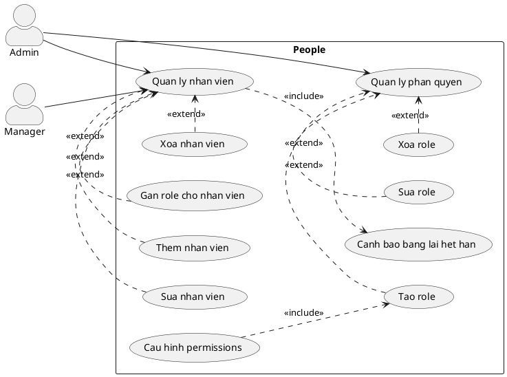
```plantuml
@startuml People Module
left to right direction
skinparam actorStyle awesome

actor "Admin" as Admin
actor "Manager" as Manager

rectangle "People" {
    usecase "Quan ly nhan vien" as UC_EMP
    usecase "Them nhan vien" as UC_EMP_C
    usecase "Sua nhan vien" as UC_EMP_U
    usecase "Xoa nhan vien" as UC_EMP_D
    usecase "Gan role cho nhan vien" as UC_EMP_ROLE
    usecase "Canh bao bang lai het han" as UC_LICENSE

    usecase "Quan ly phan quyen" as UC_ROLE
    usecase "Tao role" as UC_ROLE_C
    usecase "Sua role" as UC_ROLE_U
    usecase "Xoa role" as UC_ROLE_D
    usecase "Cau hinh permissions" as UC_PERM

    UC_EMP_C .> UC_EMP : <<extend>>
    UC_EMP_U .> UC_EMP : <<extend>>
    UC_EMP_D .> UC_EMP : <<extend>>
    UC_EMP_ROLE .> UC_EMP : <<extend>>
    UC_EMP ..> UC_LICENSE : <<include>>
    UC_ROLE_C .> UC_ROLE : <<extend>>
    UC_ROLE_U .> UC_ROLE : <<extend>>
    UC_ROLE_D .> UC_ROLE : <<extend>>
    UC_PERM ..> UC_ROLE_C : <<include>>
}

Admin --> UC_EMP
Admin --> UC_ROLE

Manager --> UC_EMP
@enduml
```

#### Module: Business

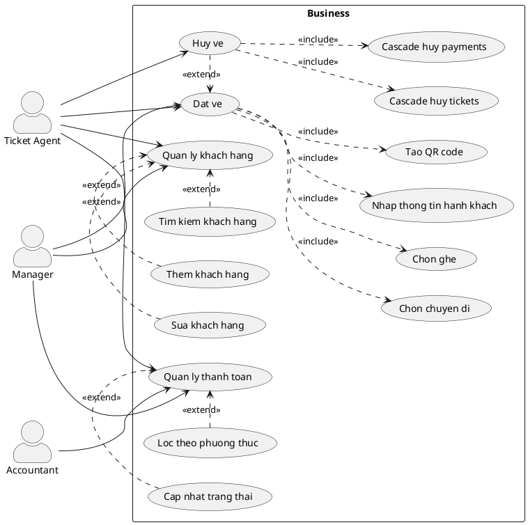
```plantuml
@startuml Business Module
left to right direction
skinparam actorStyle awesome

actor "Manager" as Manager
actor "Ticket Agent" as TicketAgent
actor "Accountant" as Accountant

rectangle "Business" {
    usecase "Quan ly khach hang" as UC_CUST
    usecase "Them khach hang" as UC_CUST_C
    usecase "Sua khach hang" as UC_CUST_U
    usecase "Tim kiem khach hang" as UC_CUST_S

    usecase "Dat ve" as UC_BOOK
    usecase "Chon chuyen di" as UC_BOOK_TRIP
    usecase "Chon ghe" as UC_BOOK_SEAT
    usecase "Nhap thong tin hanh khach" as UC_BOOK_PAX
    usecase "Tao QR code" as UC_QR
    usecase "Huy ve" as UC_CANCEL
    usecase "Cascade huy tickets" as UC_CASCADE_T
    usecase "Cascade huy payments" as UC_CASCADE_P

    usecase "Quan ly thanh toan" as UC_PAY
    usecase "Cap nhat trang thai" as UC_PAY_U
    usecase "Loc theo phuong thuc" as UC_PAY_F

    UC_CUST_C .> UC_CUST : <<extend>>
    UC_CUST_U .> UC_CUST : <<extend>>
    UC_CUST_S .> UC_CUST : <<extend>>
    UC_BOOK ..> UC_BOOK_TRIP : <<include>>
    UC_BOOK ..> UC_BOOK_SEAT : <<include>>
    UC_BOOK ..> UC_BOOK_PAX : <<include>>
    UC_BOOK ..> UC_QR : <<include>>
    UC_CANCEL .> UC_BOOK : <<extend>>
    UC_CANCEL ..> UC_CASCADE_T : <<include>>
    UC_CANCEL ..> UC_CASCADE_P : <<include>>
    UC_PAY_U .> UC_PAY : <<extend>>
    UC_PAY_F .> UC_PAY : <<extend>>
}

Manager --> UC_CUST
Manager --> UC_BOOK
Manager --> UC_PAY

TicketAgent --> UC_CUST
TicketAgent --> UC_BOOK
TicketAgent --> UC_CANCEL
TicketAgent --> UC_PAY

Accountant --> UC_PAY
@enduml
```

## 11.2 Class Diagram (Entity Models)

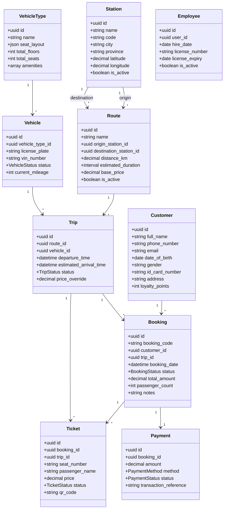
```mermaid
classDiagram
    class Customer {
        +uuid id
        +string full_name
        +string phone_number
        +string email
        +date date_of_birth
        +string gender
        +string id_card_number
        +string address
        +int loyalty_points
    }

    class Booking {
        +uuid id
        +string booking_code
        +uuid customer_id
        +uuid trip_id
        +datetime booking_date
        +BookingStatus status
        +decimal total_amount
        +int passenger_count
        +string notes
    }

    class Ticket {
        +uuid id
        +uuid booking_id
        +uuid trip_id
        +string seat_number
        +string passenger_name
        +decimal price
        +TicketStatus status
        +string qr_code
    }

    class Trip {
        +uuid id
        +uuid route_id
        +uuid vehicle_id
        +datetime departure_time
        +datetime estimated_arrival_time
        +TripStatus status
        +decimal price_override
    }

    class Vehicle {
        +uuid id
        +uuid vehicle_type_id
        +string license_plate
        +string vin_number
        +VehicleStatus status
        +int current_mileage
    }

    class VehicleType {
        +uuid id
        +string name
        +json seat_layout
        +int total_floors
        +int total_seats
        +array amenities
    }

    class Route {
        +uuid id
        +string name
        +uuid origin_station_id
        +uuid destination_station_id
        +decimal distance_km
        +interval estimated_duration
        +decimal base_price
        +boolean is_active
    }

    class Station {
        +uuid id
        +string name
        +string code
        +string city
        +string province
        +decimal latitude
        +decimal longitude
        +boolean is_active
    }

    class Employee {
        +uuid id
        +uuid user_id
        +date hire_date
        +string license_number
        +date license_expiry
        +boolean is_active
    }

    class Payment {
        +uuid id
        +uuid booking_id
        +decimal amount
        +PaymentMethod method
        +PaymentStatus status
        +string transaction_reference
    }

    Customer "1" --> "*" Booking
    Booking "1" --> "*" Ticket
    Trip "1" --> "*" Booking
    Trip "1" --> "*" Ticket
    Route "1" --> "*" Trip
    Vehicle "1" --> "*" Trip
    VehicleType "1" --> "*" Vehicle
    Station "1" --> "*" Route : origin
    Station "1" --> "*" Route : destination
    Booking "1" --> "1" Payment
```

## 11.3 Sequence Diagram: Tạo Đặt Vé

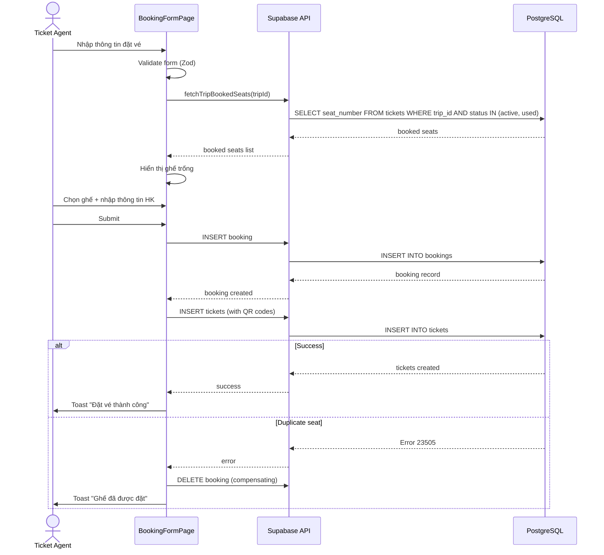
```mermaid
sequenceDiagram
    actor Agent as Ticket Agent
    participant UI as BookingFormPage
    participant API as Supabase API
    participant DB as PostgreSQL

    Agent->>UI: Nhập thông tin đặt vé
    UI->>UI: Validate form (Zod)
    UI->>API: fetchTripBookedSeats(tripId)
    API->>DB: SELECT seat_number FROM tickets WHERE trip_id AND status IN (active, used)
    DB-->>API: booked seats
    API-->>UI: booked seats list
    UI->>UI: Hiển thị ghế trống

    Agent->>UI: Chọn ghế + nhập thông tin HK
    Agent->>UI: Submit

    UI->>API: INSERT booking
    API->>DB: INSERT INTO bookings
    DB-->>API: booking record
    API-->>UI: booking created

    UI->>API: INSERT tickets (with QR codes)
    API->>DB: INSERT INTO tickets
    alt Success
        DB-->>API: tickets created
        API-->>UI: success
        UI->>Agent: Toast "Đặt vé thành công"
    else Duplicate seat
        DB-->>API: Error 23505
        API-->>UI: error
        UI->>API: DELETE booking (compensating)
        UI->>Agent: Toast "Ghế đã được đặt"
    end
```

## 11.4 Sequence Diagram: Check-in Vé

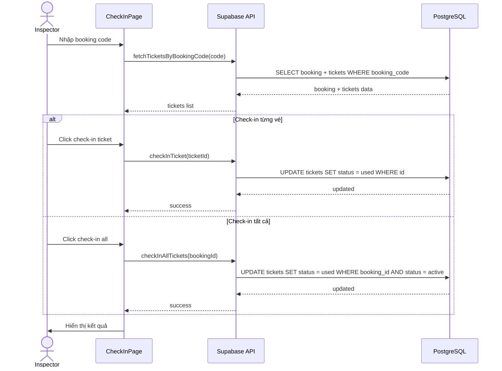
```mermaid
sequenceDiagram
    actor Inspector
    participant UI as CheckInPage
    participant API as Supabase API
    participant DB as PostgreSQL

    Inspector->>UI: Nhập booking code
    UI->>API: fetchTicketsByBookingCode(code)
    API->>DB: SELECT booking + tickets WHERE booking_code
    DB-->>API: booking + tickets data
    API-->>UI: tickets list

    alt Check-in từng vé
        Inspector->>UI: Click check-in ticket
        UI->>API: checkInTicket(ticketId)
        API->>DB: UPDATE tickets SET status = used WHERE id
        DB-->>API: updated
        API-->>UI: success
    else Check-in tất cả
        Inspector->>UI: Click check-in all
        UI->>API: checkInAllTickets(bookingId)
        API->>DB: UPDATE tickets SET status = used WHERE booking_id AND status = active
        DB-->>API: updated
        API-->>UI: success
    end

    UI->>Inspector: Hiển thị kết quả
```

## 11.5 Activity Diagram: Booking Lifecycle

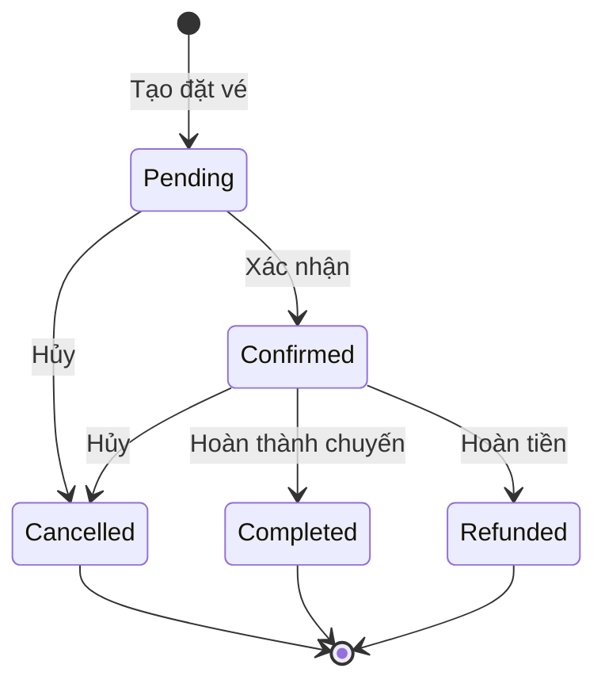
```mermaid
stateDiagram-v2
    [*] --> Pending : Tạo đặt vé
    Pending --> Confirmed : Xác nhận
    Pending --> Cancelled : Hủy
    Confirmed --> Completed : Hoàn thành chuyến
    Confirmed --> Cancelled : Hủy
    Confirmed --> Refunded : Hoàn tiền
    Cancelled --> [*]
    Completed --> [*]
    Refunded --> [*]
```

## 11.6 Activity Diagram: Payment State Machine

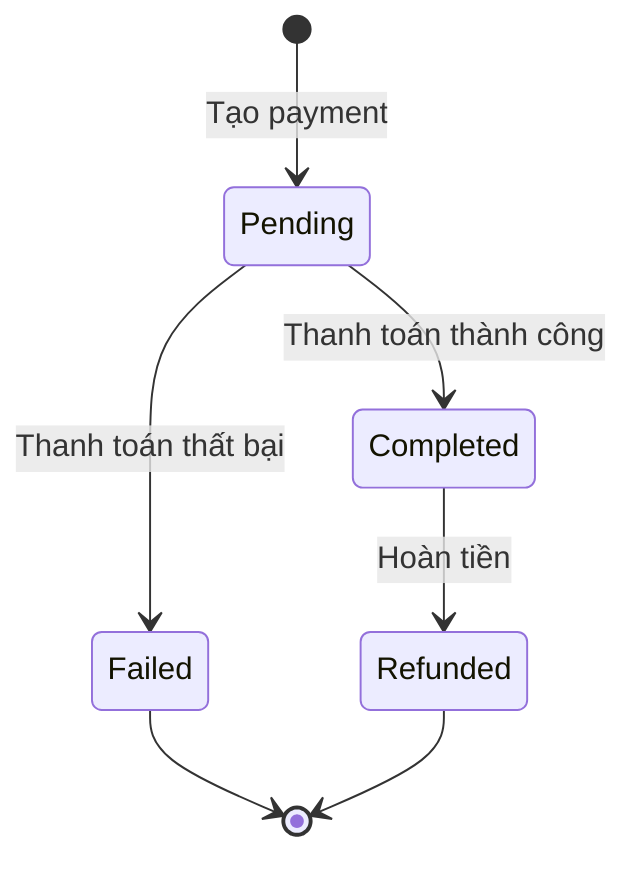
```mermaid
stateDiagram-v2
    [*] --> Pending : Tạo payment
    Pending --> Completed : Thanh toán thành công
    Pending --> Failed : Thanh toán thất bại
    Completed --> Refunded : Hoàn tiền
    Failed --> [*]
    Refunded --> [*]
```

## 11.7 Activity Diagram: Trip Lifecycle

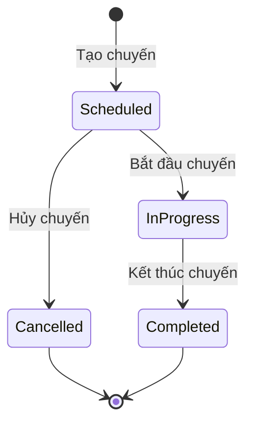
```mermaid
stateDiagram-v2
    [*] --> Scheduled : Tạo chuyến
    Scheduled --> InProgress : Bắt đầu chuyến
    Scheduled --> Cancelled : Hủy chuyến
    InProgress --> Completed : Kết thúc chuyến
    Cancelled --> [*]
    Completed --> [*]
```

## 11.8 Sequence Diagram: Đăng nhập

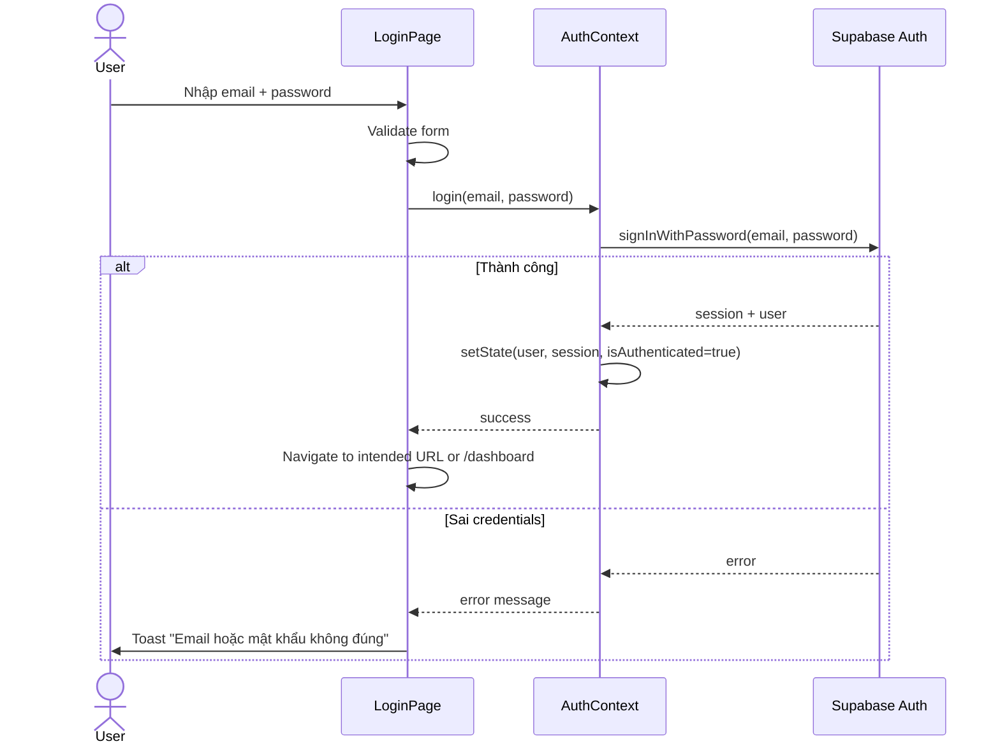
```mermaid
sequenceDiagram
    actor User
    participant UI as LoginPage
    participant Auth as AuthContext
    participant Supa as Supabase Auth

    User->>UI: Nhập email + password
    UI->>UI: Validate form
    UI->>Auth: login(email, password)
    Auth->>Supa: signInWithPassword(email, password)

    alt Thành công
        Supa-->>Auth: session + user
        Auth->>Auth: setState(user, session, isAuthenticated=true)
        Auth-->>UI: success
        UI->>UI: Navigate to intended URL or /dashboard
    else Sai credentials
        Supa-->>Auth: error
        Auth-->>UI: error message
        UI->>User: Toast "Email hoặc mật khẩu không đúng"
    end
```

## 11.9 Sequence Diagram: Quản lý chuyến đi (CRUD)

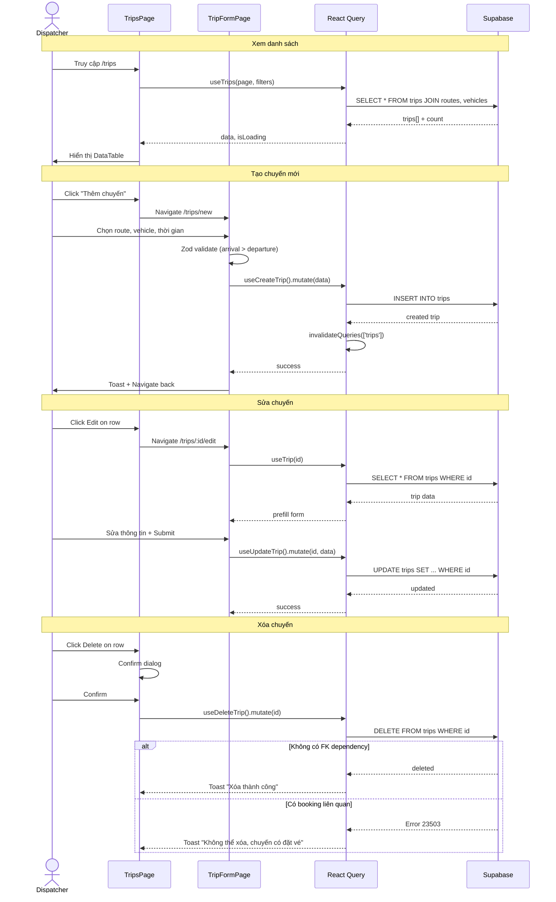
```mermaid
sequenceDiagram
    actor Dispatcher
    participant UI as TripsPage
    participant Form as TripFormPage
    participant RQ as React Query
    participant API as Supabase

    Note over Dispatcher, API: Xem danh sách
    Dispatcher->>UI: Truy cập /trips
    UI->>RQ: useTrips(page, filters)
    RQ->>API: SELECT * FROM trips JOIN routes, vehicles
    API-->>RQ: trips[] + count
    RQ-->>UI: data, isLoading
    UI->>Dispatcher: Hiển thị DataTable

    Note over Dispatcher, API: Tạo chuyến mới
    Dispatcher->>UI: Click "Thêm chuyến"
    UI->>Form: Navigate /trips/new
    Dispatcher->>Form: Chọn route, vehicle, thời gian
    Form->>Form: Zod validate (arrival > departure)
    Form->>RQ: useCreateTrip().mutate(data)
    RQ->>API: INSERT INTO trips
    API-->>RQ: created trip
    RQ->>RQ: invalidateQueries(['trips'])
    RQ-->>Form: success
    Form->>Dispatcher: Toast + Navigate back

    Note over Dispatcher, API: Sửa chuyến
    Dispatcher->>UI: Click Edit on row
    UI->>Form: Navigate /trips/:id/edit
    Form->>RQ: useTrip(id)
    RQ->>API: SELECT * FROM trips WHERE id
    API-->>RQ: trip data
    RQ-->>Form: prefill form
    Dispatcher->>Form: Sửa thông tin + Submit
    Form->>RQ: useUpdateTrip().mutate(id, data)
    RQ->>API: UPDATE trips SET ... WHERE id
    API-->>RQ: updated
    RQ-->>Form: success

    Note over Dispatcher, API: Xóa chuyến
    Dispatcher->>UI: Click Delete on row
    UI->>UI: Confirm dialog
    Dispatcher->>UI: Confirm
    UI->>RQ: useDeleteTrip().mutate(id)
    RQ->>API: DELETE FROM trips WHERE id
    alt Không có FK dependency
        API-->>RQ: deleted
        RQ-->>UI: Toast "Xóa thành công"
    else Có booking liên quan
        API-->>RQ: Error 23503
        RQ-->>UI: Toast "Không thể xóa, chuyến có đặt vé"
    end
```

## 11.10 Sequence Diagram: Phân công nhân viên

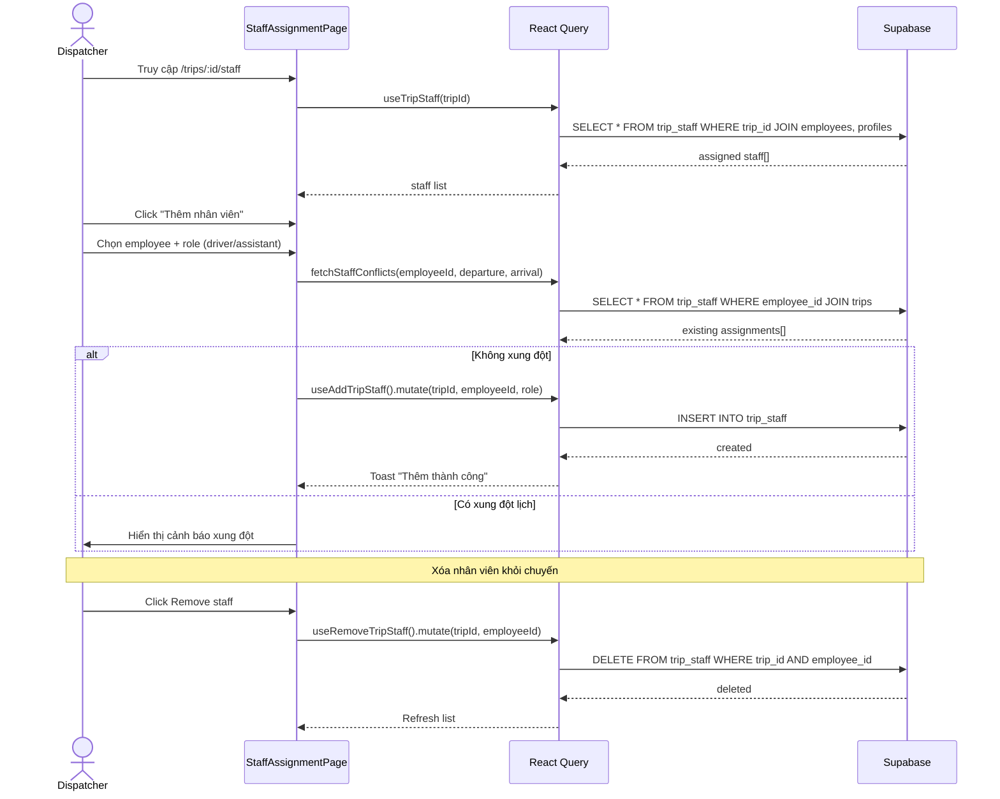
```mermaid
sequenceDiagram
    actor Dispatcher
    participant UI as StaffAssignmentPage
    participant RQ as React Query
    participant API as Supabase

    Dispatcher->>UI: Truy cập /trips/:id/staff
    UI->>RQ: useTripStaff(tripId)
    RQ->>API: SELECT * FROM trip_staff WHERE trip_id JOIN employees, profiles
    API-->>RQ: assigned staff[]
    RQ-->>UI: staff list

    Dispatcher->>UI: Click "Thêm nhân viên"
    Dispatcher->>UI: Chọn employee + role (driver/assistant)
    UI->>RQ: fetchStaffConflicts(employeeId, departure, arrival)
    RQ->>API: SELECT * FROM trip_staff WHERE employee_id JOIN trips
    API-->>RQ: existing assignments[]

    alt Không xung đột
        UI->>RQ: useAddTripStaff().mutate(tripId, employeeId, role)
        RQ->>API: INSERT INTO trip_staff
        API-->>RQ: created
        RQ-->>UI: Toast "Thêm thành công"
    else Có xung đột lịch
        UI->>Dispatcher: Hiển thị cảnh báo xung đột
    end

    Note over Dispatcher, API: Xóa nhân viên khỏi chuyến
    Dispatcher->>UI: Click Remove staff
    UI->>RQ: useRemoveTripStaff().mutate(tripId, employeeId)
    RQ->>API: DELETE FROM trip_staff WHERE trip_id AND employee_id
    API-->>RQ: deleted
    RQ-->>UI: Refresh list
```

## 11.11 Sequence Diagram: Hủy đặt vé (Cascade)

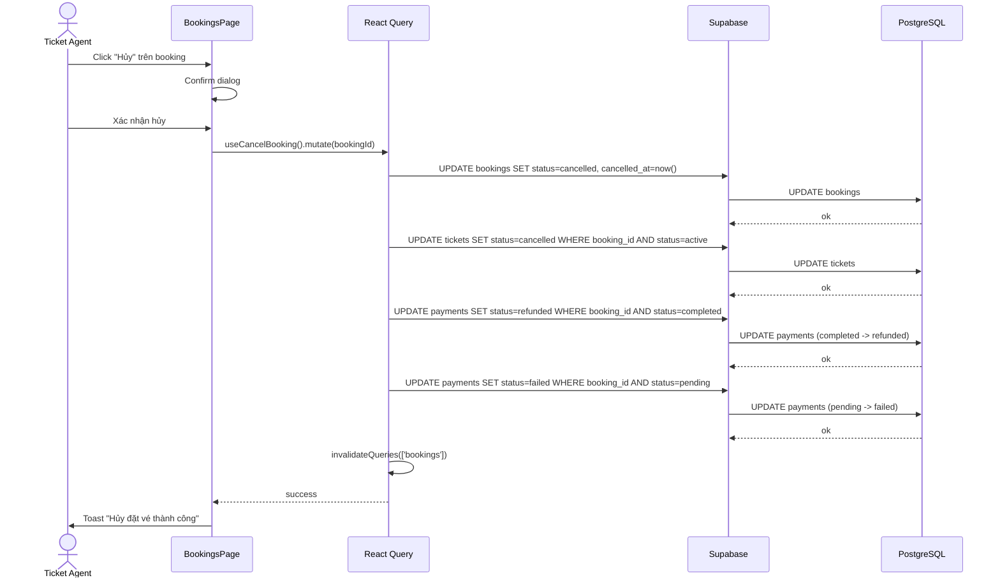
```mermaid
sequenceDiagram
    actor Agent as Ticket Agent
    participant UI as BookingsPage
    participant RQ as React Query
    participant API as Supabase
    participant DB as PostgreSQL

    Agent->>UI: Click "Hủy" trên booking
    UI->>UI: Confirm dialog
    Agent->>UI: Xác nhận hủy

    UI->>RQ: useCancelBooking().mutate(bookingId)

    RQ->>API: UPDATE bookings SET status=cancelled, cancelled_at=now()
    API->>DB: UPDATE bookings
    DB-->>API: ok

    RQ->>API: UPDATE tickets SET status=cancelled WHERE booking_id AND status=active
    API->>DB: UPDATE tickets
    DB-->>API: ok

    RQ->>API: UPDATE payments SET status=refunded WHERE booking_id AND status=completed
    API->>DB: UPDATE payments (completed -> refunded)
    DB-->>API: ok

    RQ->>API: UPDATE payments SET status=failed WHERE booking_id AND status=pending
    API->>DB: UPDATE payments (pending -> failed)
    DB-->>API: ok

    RQ->>RQ: invalidateQueries(['bookings'])
    RQ-->>UI: success
    UI->>Agent: Toast "Hủy đặt vé thành công"
```

## 11.12 Sequence Diagram: Quản lý xe

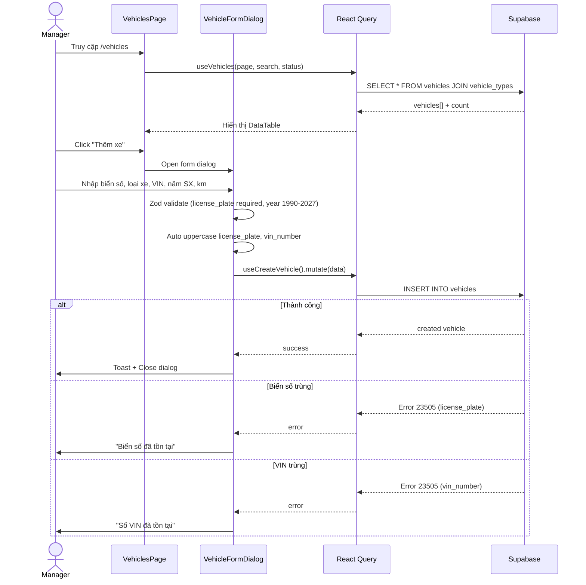
```mermaid
sequenceDiagram
    actor Manager
    participant UI as VehiclesPage
    participant Dialog as VehicleFormDialog
    participant RQ as React Query
    participant API as Supabase

    Manager->>UI: Truy cập /vehicles
    UI->>RQ: useVehicles(page, search, status)
    RQ->>API: SELECT * FROM vehicles JOIN vehicle_types
    API-->>RQ: vehicles[] + count
    RQ-->>UI: Hiển thị DataTable

    Manager->>UI: Click "Thêm xe"
    UI->>Dialog: Open form dialog
    Manager->>Dialog: Nhập biển số, loại xe, VIN, năm SX, km
    Dialog->>Dialog: Zod validate (license_plate required, year 1990-2027)
    Dialog->>Dialog: Auto uppercase license_plate, vin_number
    Dialog->>RQ: useCreateVehicle().mutate(data)
    RQ->>API: INSERT INTO vehicles

    alt Thành công
        API-->>RQ: created vehicle
        RQ-->>Dialog: success
        Dialog->>Manager: Toast + Close dialog
    else Biển số trùng
        API-->>RQ: Error 23505 (license_plate)
        RQ-->>Dialog: error
        Dialog->>Manager: "Biển số đã tồn tại"
    else VIN trùng
        API-->>RQ: Error 23505 (vin_number)
        RQ-->>Dialog: error
        Dialog->>Manager: "Số VIN đã tồn tại"
    end
```

## 11.13 Sequence Diagram: Quản lý bảo trì

```mermaid
sequenceDiagram
    actor Manager
    participant List as MaintenancePage
    participant Form as MaintenanceFormPage
    participant RQ as React Query
    participant API as Supabase

    Manager->>List: Truy cập /maintenance
    List->>RQ: useMaintenanceLogs(page, vehicleId, type)
    RQ->>API: SELECT * FROM maintenance_logs JOIN vehicles, profiles
    API-->>RQ: logs[] + count
    RQ-->>List: Hiển thị danh sách

    Manager->>List: Click "Thêm log bảo trì"
    List->>Form: Navigate /maintenance/new
    Manager->>Form: Chọn xe, loại bảo trì, nhập chi phí, mô tả
    Form->>Form: Zod validate
    Form->>RQ: useCreateMaintenanceLog().mutate(data)
    RQ->>API: INSERT INTO maintenance_logs
    API-->>RQ: created
    RQ-->>Form: success
    Form->>Manager: Toast + Navigate back to list
```

## 11.14 Sequence Diagram: Quản lý tuyến đường và điểm dừng

```mermaid
sequenceDiagram
    actor Manager
    participant Routes as RoutesPage
    participant Form as RouteFormPage
    participant Stops as RouteStopsPage
    participant RQ as React Query
    participant API as Supabase

    Note over Manager, API: Tạo tuyến đường
    Manager->>Routes: Click "Thêm tuyến"
    Routes->>Form: Navigate /routes/new
    Manager->>Form: Nhập tên, trạm đi, trạm đến, khoảng cách, giá
    Form->>RQ: useCreateRoute().mutate(data)
    RQ->>API: INSERT INTO routes
    API-->>RQ: created route
    RQ-->>Form: Navigate back

    Note over Manager, API: Quản lý điểm dừng
    Manager->>Routes: Click "Điểm dừng" trên route
    Routes->>Stops: Navigate /routes/:id/stops
    Stops->>RQ: useRouteStops(routeId)
    RQ->>API: SELECT * FROM route_stops WHERE route_id ORDER BY stop_order
    API-->>RQ: stops[]
    RQ-->>Stops: Hiển thị danh sách stops

    Manager->>Stops: Thêm/Sắp xếp/Xóa stops
    Manager->>Stops: Click "Lưu"
    Stops->>RQ: useSaveRouteStops().mutate(routeId, stops[])
    RQ->>API: DELETE FROM route_stops WHERE route_id
    API-->>RQ: deleted all
    RQ->>API: INSERT INTO route_stops (batch)
    API-->>RQ: inserted
    RQ-->>Stops: Toast "Lưu thành công"
```

## 11.15 Sequence Diagram: Quản lý nhân viên và phân quyền

```mermaid
sequenceDiagram
    actor Admin
    participant List as EmployeesPage
    participant Form as EmployeeFormPage
    participant RQ as React Query
    participant API as Supabase

    Admin->>List: Truy cập /employees
    List->>RQ: useEmployees(page, search, isActive)
    RQ->>API: SELECT * FROM employees JOIN profiles
    API-->>RQ: employees[] + count
    RQ-->>List: Hiển thị (cảnh báo license sắp hết hạn 30 ngày)

    Admin->>List: Click "Thêm nhân viên"
    List->>Form: Navigate /employees/new
    Form->>RQ: fetchProfiles()
    RQ->>API: SELECT * FROM profiles ORDER BY full_name
    API-->>RQ: profiles[]
    RQ-->>Form: Dropdown chọn user profile

    Admin->>Form: Chọn profile, nhập hire_date, license info
    Form->>RQ: useCreateEmployee().mutate(data)
    RQ->>API: INSERT INTO employees
    API-->>RQ: created

    Note over Admin, API: Gán role
    Admin->>Form: Chọn role cho nhân viên
    Form->>RQ: assignEmployeeRole(userId, roleId)
    RQ->>API: DELETE FROM user_roles WHERE user_id
    API-->>RQ: deleted old role
    RQ->>API: INSERT INTO user_roles (user_id, role_id)
    API-->>RQ: assigned
    RQ-->>Form: Toast "Cập nhật thành công"
```

## 11.16 Sequence Diagram: Quản lý thanh toán

```mermaid
sequenceDiagram
    actor Accountant
    participant UI as PaymentsPage
    participant RQ as React Query
    participant API as Supabase

    Accountant->>UI: Truy cập /payments
    UI->>RQ: usePayments(page, status, method, dateFrom, dateTo, search)
    RQ->>API: SELECT * FROM payments JOIN bookings
    API-->>RQ: payments[] + count
    RQ-->>UI: Hiển thị DataTable

    Accountant->>UI: Click "Cập nhật trạng thái" trên payment
    UI->>UI: Hiển thị dialog chọn status mới

    Accountant->>UI: Chọn status = "completed"
    UI->>RQ: useUpdatePaymentStatus().mutate(id, newStatus)

    RQ->>API: SELECT status FROM payments WHERE id
    API-->>RQ: current status = "pending"

    alt Transition hợp lệ (pending -> completed)
        RQ->>API: UPDATE payments SET status=completed, paid_at=now()
        API-->>RQ: updated
        RQ-->>UI: Toast "Cập nhật thành công"
    else Transition không hợp lệ (failed -> completed)
        RQ-->>UI: Error "Không thể chuyển từ failed sang completed"
        UI->>Accountant: Toast error
    end
```

## 11.17 Sequence Diagram: Quản lý khách hàng

```mermaid
sequenceDiagram
    actor Agent as Ticket Agent
    participant UI as CustomersPage
    participant Dialog as CustomerFormDialog
    participant RQ as React Query
    participant API as Supabase

    Agent->>UI: Truy cập /customers
    UI->>RQ: useCustomers(page, search)
    RQ->>API: SELECT * FROM customers (ilike name, phone, email)
    API-->>RQ: customers[] + count
    RQ-->>UI: Hiển thị DataTable

    Agent->>UI: Click "Thêm khách hàng"
    UI->>Dialog: Open form
    Agent->>Dialog: Nhập họ tên, SĐT, email, CMND
    Dialog->>Dialog: Zod validate (phone regex 0\d{9,10}, email format)

    Dialog->>RQ: useCreateCustomer().mutate(data)
    RQ->>API: INSERT INTO customers

    alt Thành công
        API-->>RQ: created
        RQ-->>Dialog: Close + Toast success
    else SĐT trùng
        API-->>RQ: Error 23505 (phone_number)
        Dialog->>Agent: "Số điện thoại đã tồn tại"
    else Email trùng
        API-->>RQ: Error 23505 (email)
        Dialog->>Agent: "Email đã tồn tại"
    end
```

## 11.18 Sequence Diagram: Dashboard Load

```mermaid
sequenceDiagram
    actor User as Manager
    participant UI as DashboardPage
    participant RQ as React Query
    participant API as Supabase

    User->>UI: Truy cập /dashboard
    
    par Parallel API calls
        UI->>RQ: fetchDashboardStats()
        RQ->>API: COUNT vehicles(active) + trips(today) + bookings(today) + SUM payments(month)
        API-->>RQ: stats KPIs

        UI->>RQ: fetchRecentBookings()
        RQ->>API: SELECT bookings ORDER BY booking_date DESC LIMIT 5
        API-->>RQ: recent bookings

        UI->>RQ: fetchUpcomingTrips()
        RQ->>API: SELECT trips WHERE departure > now() ORDER BY departure ASC LIMIT 5
        API-->>RQ: upcoming trips

        UI->>RQ: fetchRevenueTrend()
        RQ->>API: SELECT date, SUM(amount) FROM payments WHERE last 7 days GROUP BY date
        API-->>RQ: revenue data

        UI->>RQ: fetchTripStatusBreakdown()
        RQ->>API: SELECT status, COUNT FROM trips WHERE current month GROUP BY status
        API-->>RQ: trip breakdown

        UI->>RQ: fetchBookingStatusBreakdown()
        RQ->>API: SELECT status, COUNT FROM bookings WHERE current month GROUP BY status
        API-->>RQ: booking breakdown
    end

    RQ-->>UI: All data loaded
    UI->>User: Render KPI cards + Charts + Lists
```

## 11.19 Sequence Diagram: Xem lịch cá nhân

```mermaid
sequenceDiagram
    actor Driver
    participant UI as MySchedulePage
    participant RQ as React Query
    participant API as Supabase
    participant Auth as AuthContext

    Driver->>UI: Truy cập /my-schedule
    UI->>Auth: getCurrentUser()
    Auth-->>UI: user.id

    UI->>RQ: fetchMySchedule(userId)
    RQ->>API: SELECT * FROM employees WHERE user_id
    
    alt Có employee record
        API-->>RQ: employee
        RQ->>API: SELECT * FROM trip_staff WHERE employee_id JOIN trips, routes
        API-->>RQ: assigned trips[]
        RQ-->>UI: schedule data
        UI->>Driver: Hiển thị danh sách chuyến được phân công
    else Không có employee record (PGRST116)
        API-->>RQ: error
        RQ-->>UI: empty array
        UI->>Driver: "Bạn chưa được liên kết với nhân viên nào"
    end
```

## 11.20 Sequence Diagram: Quản lý trạm

```mermaid
sequenceDiagram
    actor Manager
    participant UI as StationsPage
    participant Dialog as StationFormDialog
    participant RQ as React Query
    participant API as Supabase

    Manager->>UI: Truy cập /stations
    UI->>RQ: useStations(page, search, isActive)
    RQ->>API: SELECT * FROM stations (ilike name, city)
    API-->>RQ: stations[] + count
    RQ-->>UI: Hiển thị DataTable

    Manager->>UI: Click "Thêm trạm"
    UI->>Dialog: Open form
    Manager->>Dialog: Nhập tên, mã, địa chỉ, thành phố, tỉnh, tọa độ
    Dialog->>Dialog: Zod validate (name required, code required)
    Dialog->>RQ: useCreateStation().mutate(data)
    RQ->>API: INSERT INTO stations

    alt Thành công
        API-->>RQ: created
        RQ-->>Dialog: Close + Toast success
    else Mã trạm trùng
        API-->>RQ: Error 23505 (code)
        Dialog->>Manager: "Mã trạm đã tồn tại"
    end
```

## 11.21 Sequence Diagram: Quản lý loại xe

```mermaid
sequenceDiagram
    actor Manager
    participant UI as VehicleTypesPage
    participant Dialog as VehicleTypeFormDialog
    participant RQ as React Query
    participant API as Supabase

    Manager->>UI: Truy cập /vehicle-types
    UI->>RQ: useVehicleTypes(page, search)
    RQ->>API: SELECT * FROM vehicle_types
    API-->>RQ: types[] + count
    RQ-->>UI: Hiển thị DataTable

    Manager->>UI: Click "Thêm loại xe"
    UI->>Dialog: Open form
    Manager->>Dialog: Nhập tên, mô tả, số tầng, tổng ghế
    Manager->>Dialog: Thiết kế seat_layout (drag and drop)
    Manager->>Dialog: Chọn amenities
    Dialog->>RQ: useCreateVehicleType().mutate(data)
    RQ->>API: INSERT INTO vehicle_types (seat_layout as JSONB)
    API-->>RQ: created
    RQ-->>Dialog: Close + Toast success
```

---

# 12. Technology Stack

## 12.1 Frontend

| Category | Technology | Version | Purpose |
|----------|-----------|---------|---------|
| Framework | React | 18.3.1 | UI library |
| Language | TypeScript | 5.6.2 | Type safety |
| Build Tool | Vite | 6.0.7 | Dev server + bundler |
| Routing | React Router DOM | 6.28.1 | Client-side routing |
| State (Server) | TanStack React Query | 5.62.11 | Data fetching + caching |
| State (Form) | React Hook Form | 7.54.2 | Form management |
| Validation | Zod | 3.24.1 | Schema validation |
| Styling | Tailwind CSS | 3.4.17 | Utility-first CSS |
| UI Primitives | Radix UI | various | Accessible components |
| Icons | Lucide React | 0.468.0 | Icon library |
| Charts | Recharts | 3.8.1 | Data visualization |
| QR Code | qrcode.react | 4.2.0 | QR generation |
| Date | date-fns + dayjs | 4.1.0 / 1.11.13 | Date utilities |
| DnD | @dnd-kit | 6.3.1 | Drag and drop |
| Calendar | React Day Picker | 9.14.0 | Calendar component |

## 12.2 Backend

| Category | Technology | Purpose |
|----------|-----------|---------|
| BaaS | Supabase | Backend-as-a-Service |
| Database | PostgreSQL | Relational database |
| API | PostgREST | Auto-generated REST API |
| Auth | Supabase Auth | Authentication service |
| SDK | @supabase/supabase-js | 2.48.1 | Client SDK |

## 12.3 DevOps / Deployment

| Category | Technology | Purpose |
|----------|-----------|---------|
| Hosting | Vercel | Static site hosting |
| Version Control | Git | Source control |
| Linting | ESLint | 9.18.0 | Code quality |
| Formatting | Prettier | 3.4.2 | Code formatting |
| CSS Processing | PostCSS + Autoprefixer | CSS transforms |

---

# 13. Deployment Architecture

## 13.1 Environment

| Environment | URL | Purpose |
|-------------|-----|---------|
| Production | Vercel deployment | Live system |
| Development | localhost:5173 | Local development |

## 13.2 Build Process

```bash
# Install dependencies
npm install

# Development server
npm run dev

# Production build
npm run build  # → dist/ folder

# Preview production build
npm run preview
```

## 13.3 Vercel Configuration

File: `vercel.json`
- URL rewrites: tất cả routes → index.html (SPA fallback)

## 13.4 Environment Variables

| Variable | Required | Description |
|----------|----------|-------------|
| VITE_SUPABASE_URL | Yes | Supabase project URL |
| VITE_SUPABASE_ANON_KEY | Yes | Supabase anonymous API key |

## 13.5 Architecture Diagram

```mermaid
graph LR
    subgraph Client
        Browser["Browser"]
    end

    subgraph Vercel["Vercel CDN"]
        Static["Static Files (React SPA)"]
    end

    subgraph Supabase["Supabase Cloud"]
        Auth["Auth Service"]
        API["PostgREST API"]
        DB["PostgreSQL"]
    end

    Browser --> Static
    Browser --> Auth
    Browser --> API
    API --> DB
    Auth --> DB
```

---

# 14. Risks and Limitations

## 14.1 Technical Risks

| # | Risk | Impact | Probability | Mitigation |
|---|------|--------|-------------|------------|
| R-01 | Supabase service outage | High | Low | Không có fallback, phụ thuộc hoàn toàn |
| R-02 | Anon key exposure | Medium | High | RLS policies bảo vệ data access |
| R-03 | Race condition khi đặt ghế | Medium | Medium | Unique constraint catch duplicate |
| R-04 | No offline support | Medium | High | Yêu cầu internet liên tục |
| R-05 | Client-side business logic | Medium | Medium | Logic có thể bị bypass |

## 14.2 Known Limitations

| # | Limitation | Description |
|---|-----------|-------------|
| L-01 | Không có permission enforcement | Roles/permissions defined nhưng chưa enforce ở UI |
| L-02 | Không có audit trail | Không log ai làm gì, khi nào |
| L-03 | Không có real-time updates | Dữ liệu không tự refresh khi có thay đổi |
| L-04 | Không có export/report | Không xuất báo cáo PDF/Excel |
| L-05 | Không có notification system | Không thông báo push/email |
| L-06 | Không có multi-language | Chỉ hỗ trợ tiếng Việt |
| L-07 | Compensating transaction | Không phải true ACID transaction |
| L-08 | Client-side conflict detection | Staff scheduling conflict check ở client |

## 14.3 Future Improvements

| # | Improvement | Priority |
|---|------------|----------|
| IMP-01 | Implement route-level permission enforcement | High |
| IMP-02 | Add audit logging | High |
| IMP-03 | Real-time updates via Supabase Realtime | Medium |
| IMP-04 | Report generation (PDF/Excel) | Medium |
| IMP-05 | Push notifications | Medium |
| IMP-06 | Offline mode with sync | Low |
| IMP-07 | Mobile responsive optimization | Medium |
| IMP-08 | Multi-language support | Low |
| IMP-09 | Advanced analytics/BI dashboard | Low |
| IMP-10 | Integration with payment gateways | High |

---

# 15. Extra Analysis

## 15.1 Source Code Quality Assessment

| Aspect | Rating | Notes |
|--------|--------|-------|
| TypeScript Usage | Excellent | Strict mode, comprehensive typing |
| Code Organization | Excellent | FSD architecture, clear separation |
| Naming Conventions | Good | Consistent camelCase/PascalCase |
| Error Handling | Good | Zod validation, error mapping |
| Code Reuse | Good | Shared UI components, query patterns |
| Documentation | Fair | Minimal comments (acceptable for typed code) |
| Test Coverage | Poor | Không tìm thấy test files trong source code |

## 15.2 Architecture Review

**Strengths:**
- Feature-Sliced Design cho phép scale team và codebase
- Entity-driven API layer tách biệt data access
- React Query caching giảm unnecessary API calls
- Lazy loading routes cải thiện initial load time
- Consistent patterns across all entities

**Weaknesses:**
- Business logic nằm ở client-side (có thể bypass)
- Không có middleware layer giữa UI và API
- Compensating transaction thay vì true database transaction
- Staff conflict detection ở client (race condition possible)

## 15.3 Security Review

**Implemented:**
- Authentication via Supabase Auth (industry standard)
- JWT token management
- Input validation (Zod)
- Parameterized queries (Supabase SDK)
- Environment variable protection

**Missing:**
- Route-level authorization enforcement
- API rate limiting
- Audit logging
- Content Security Policy headers
- CORS configuration (handled by Supabase)

## 15.4 Potential Bugs/Risks

| # | Issue | Severity | Location |
|---|-------|----------|----------|
| BUG-01 | Race condition: 2 agents đặt cùng ghế | Medium | booking.api.ts |
| BUG-02 | Compensating transaction có thể fail | Medium | createBookingWithTickets |
| BUG-03 | Client-side staff conflict miss edge cases | Low | trip-staff.api.ts |
| BUG-04 | No pagination limit enforcement | Low | All list APIs |
| BUG-05 | Date timezone issues (client vs server) | Low | Date filters |

## 15.5 Missing Validation

| # | Missing | Where |
|---|---------|-------|
| VAL-01 | Max booking per customer per trip | booking.api.ts |
| VAL-02 | Vehicle capacity vs ticket count | booking form |
| VAL-03 | Trip departure must be future date | trip form |
| VAL-04 | Employee must have valid license for driver role | staff assignment |
| VAL-05 | Route must have at least origin and destination | route form |

## 15.6 Scalability Concerns

- Offset-based pagination degrades with large datasets (consider cursor-based)
- Dashboard aggregation queries hit multiple tables (consider materialized views)
- No caching layer between client and Supabase
- Calendar view fetches all trips in range without limit

## 15.7 Technical Debt

| # | Debt | Impact |
|---|------|--------|
| TD-01 | Duplicate date utility libraries (date-fns + dayjs) | Bundle size |
| TD-02 | No test infrastructure | Regression risk |
| TD-03 | Permission system defined but not enforced | Security gap |
| TD-04 | Some business logic duplicated across pages | Maintenance |
| TD-05 | No API error standardization layer | Inconsistent UX |

## 15.8 Refactoring Suggestions

1. **Consolidate date libraries** - Chọn 1 (date-fns hoặc dayjs), remove còn lại
2. **Add test infrastructure** - Vitest + React Testing Library
3. **Implement permission middleware** - HOC hoặc hook kiểm tra permissions
4. **Server-side business rules** - Supabase Edge Functions cho critical logic
5. **Standardize error handling** - Centralized error interceptor
6. **Add API response types** - Generic response wrapper

## 15.9 Missing Requirements (Recommended)

| # | Requirement | Business Value |
|---|------------|----------------|
| MR-01 | Booking confirmation email/SMS | Customer communication |
| MR-02 | Vehicle GPS tracking | Real-time fleet monitoring |
| MR-03 | Driver performance metrics | Quality management |
| MR-04 | Revenue reporting | Business intelligence |
| MR-05 | Customer loyalty program logic | Customer retention |
| MR-06 | Seat selection UI with visual layout | Better UX |
| MR-07 | Multi-stop booking | Complex itineraries |
| MR-08 | Recurring trip templates | Operational efficiency |
| MR-09 | Maintenance alerts/reminders | Preventive maintenance |
| MR-10 | Integration with e-wallet APIs | Payment automation |

---

# Appendix A: File Structure Reference

```
E:\ptit\fleet-go-v5\
├── public/
├── src/
│   ├── app/
│   │   ├── layouts/app-layout/ui/
│   │   │   ├── app-layout.tsx
│   │   │   └── sidebar.tsx
│   │   ├── lib/
│   │   │   ├── router.tsx
│   │   │   ├── route-wrapper.tsx
│   │   │   └── query-client.ts
│   │   ├── providers/
│   │   │   ├── app-providers.tsx
│   │   │   └── auth-provider.tsx
│   │   ├── styles/
│   │   └── app.tsx
│   ├── entities/
│   │   ├── booking/
│   │   ├── customer/
│   │   ├── employee/
│   │   ├── maintenance-log/
│   │   ├── payment/
│   │   ├── role/
│   │   ├── route/
│   │   ├── route-stop/
│   │   ├── station/
│   │   ├── ticket/
│   │   ├── trip/
│   │   ├── trip-staff/
│   │   ├── vehicle/
│   │   └── vehicle-type/
│   ├── pages/
│   │   ├── bookings/
│   │   ├── check-in/
│   │   ├── customers/
│   │   ├── dashboard/
│   │   ├── employees/
│   │   ├── login/
│   │   ├── maintenance/
│   │   ├── my-schedule/
│   │   ├── payments/
│   │   ├── roles/
│   │   ├── routes/
│   │   ├── stations/
│   │   ├── trip-calendar/
│   │   ├── trips/
│   │   ├── vehicle-types/
│   │   └── vehicles/
│   ├── shared/
│   │   ├── api/
│   │   ├── auth/
│   │   ├── config/
│   │   ├── lib/
│   │   └── ui/
│   └── main.tsx
├── package.json
├── tsconfig.json
├── vite.config.ts
├── vercel.json
├── tailwind.config.js
└── postcss.config.js
```

---

# Appendix B: Business Rules Summary

| # | Rule | Module | Enforcement |
|---|------|--------|-------------|
| BR-01 | Booking code must be unique | Bookings | DB unique constraint |
| BR-02 | Cannot double-book a seat | Tickets | DB unique constraint (trip_id, seat_number) |
| BR-03 | Payment status follows state machine | Payments | Client-side validation |
| BR-04 | Trip arrival must be after departure | Trips | Zod schema validation |
| BR-05 | Staff cannot have schedule conflicts | Trip Staff | Client-side time overlap check |
| BR-06 | Cancel booking cascades to tickets and payments | Bookings | Application logic |
| BR-07 | Only active tickets can be checked in | Tickets | API filter |
| BR-08 | License plate must be unique | Vehicles | DB unique constraint |
| BR-09 | Employee license expiry warning at 30 days | Employees | UI display logic |
| BR-10 | Route stops use replace pattern (delete all + insert) | Route Stops | Application logic |

---

*Tài liệu được tạo tự động từ phân tích source code.*
*Phiên bản: 1.0 | Ngày: 2026-05-19*
*Công cụ: Claude Code Analysis*
